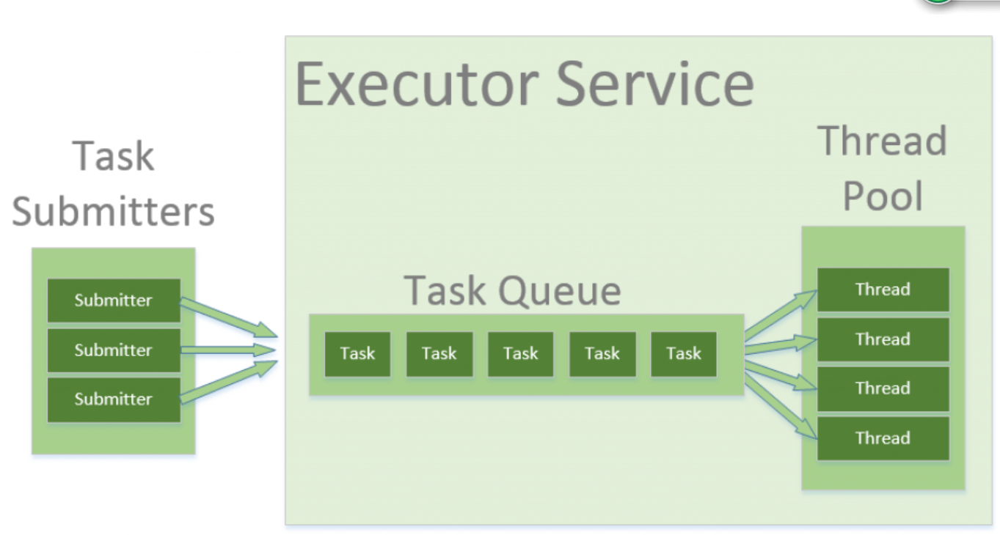

# troduction to Thread Pools in Java

## **Thread Pools in Java**

Executors

Executor 

ExecutorService

## ThreadPoolExecutor

corePoolSize

maximumPoolSize

keepAliveTime

## ForkJoinPool

In a *fork/join* framework, any task can spawn (*fork*) a number of subtasks and wait for their completion using the *join* method. The benefit of the *fork/join* framework is that it **does not create a new thread for each task or subtask**

## Runnable or Thread?

Simply put, we generally encourage the use of *Runnable* over *Thread*:

- When extending the *Thread* class, we're not overriding any of its methods. Instead, we override the method of *Runnable (*which *Thread* happens to implement*)*. This is a clear violation of IS-A *Thread*principle
- Creating an implementation of *Runnable* and passing it to the *Thread* class utilizes composition and not inheritance – which is more flexible
- After extending the *Thread* class, we can't extend any other class
- From Java 8 onwards, *Runnables* can be represented as lambda expressions

## wait and notify() Methods

Object.wait() – to suspend a thread
Object.notify() – to wake a thread up

## Fork/Join Framework

- **Use as few thread pools as possible** – in most cases, the best decision is to use one thread pool per application or system
- **Use the default common thread pool,** if no specific tuning is needed
- **Use a reasonable threshold** for splitting *ForkJoingTask* into subtasks
- **Avoid any blocking in your** ***ForkJoingTasks\***

## **Differences Between Lock and Synchronized Block**

There are few differences between the use of synchronized *block* and using *Lock* API's:

- **A \*synchronized\* \*block\* is fully contained within a method –** we can have *Lock* API's *lock()* and *unlock()* operation in separate methods
- A s*ynchronized block* doesn't support the fairness, any thread can acquire the lock once released, no preference can be specified. **We can achieve fairness within the \*Lock\* APIs by specifying the\*fairness\* property**. It makes sure that longest waiting thread is given access to the lock
- A thread gets blocked if it can't get an access to the synchronized *block*. **The \*Lock\* API provides\*tryLock()\* method. The thread acquires lock only if it's available and not held by any other thread.**This reduces blocking time of thread waiting for the lock
- A thread which is in “waiting” state to acquire the access to *synchronized block*, can't be interrupted. **The \*Lock\* API provides a method \*lockInterruptibly()\* which can be used to interrupt the thread when it's waiting for the lock**

## LOCK

Let's take a look at the methods in the *Lock* interface:

- ***void lock()** –* acquire the lock if it's available; if the lock isn't available a thread gets blocked until the lock is released
- ***void lockInterruptibly()\*** – this is similar to the *lock(),* but it allows the blocked thread to be interrupted and resume the execution through a thrown *java.lang.InterruptedException*
- ***boolean tryLock()\*** – this is a non-blocking version of *lock()* method; it attempts to acquire the lock immediately, return true if locking succeeds
- ***boolean tryLock(long timeout, TimeUnit timeUnit)** –* this is similar to *tryLock(),* except it waits up the given timeout before giving up trying to acquire the *Lock*
- **void \*unlock()\*** – unlocks the *Lock* instance

### ReentrantLock

ReentrantLock class implements the Lock interface. It offers the same concurrency and memory semantics, as the implicit monitor lock accessed using synchronized methods and statements, with extended capabilities.

### ReentrantReadWriteLock

 *ReentrantReadWriteLock* class implements the *ReadWriteLock* interface.

Let's see rules for acquiring the *ReadLock* or *WriteLock* by a thread:

- **Read Lock** – if no thread acquired the write lock or requested for it then multiple threads can acquire the read lock
- **Write Lock** – if no threads are reading or writing then only one thread can acquire the write lock

### StampedLock

*StampedLock* is introduced in Java 8. It also supports both read and write locks. However, lock acquisition methods returns a stamp that is used to release a lock or to check if the lock is still valid

### Condition 

The Condition class provides the ability for a thread to wait for some condition to occur while executing the critical section.

## Java CyclicBarrier vs CountDownLatch

首先，CountDownLatch和CyclicBarrier都用于管理多线程应用程序。

而且，它们都旨在表示给定线程或线程组应如何等待。

* CountDownLatch

  CountDownLatch是一个线程等待其他线程在锁存器上递减计数直至达到零之前的构造。

  我们可以将其视为正在准备的餐厅的一道菜。 无论由哪个厨师准备n种食物，服务员都必须等到所有食物都放在盘子上。 如果一个盘子可容纳n个物品，那么任何厨师都会在她放在盘子上的每个物品上倒扣。

* CyclicBarrier

  CyclicBarrier是可重用的构造，其中一组线程一起等待，直到所有线程到达为止。 在这一点上，障碍被打破，可以选择采取措施。

  我们可以将其视为一群朋友。 每当他们计划在餐厅用餐时，他们都会决定可以见面的共同点。 他们在那儿等着，只有每个人到了，他们才能一起去餐厅吃饭。

### Tasks vs. Threads

让我们更深入地研究这两个类之间的一些语义差异。

如定义中所述，CyclicBarrier允许多个线程互相等待，而CountDownLatch允许一个或多个线程等待许多任务完成。

简而言之，CyclicBarrier维护线程数，而CountDownLatch维护任务数。