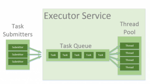

# Java线程池简介

## 1.简介
本文介绍了Java中的线程池-从标准Java库中的不同实现开始，然后介绍Google的Guava库。

## 2.线程池
在Java中，线程被映射到系统级线程，这是操作系统的资源。如果无法控制地创建线程，则可能会很快耗尽这些资源。


线程之间的上下文切换也由操作系统完成-为了模拟并行性。一个简单的观点是–产生的线程越多，每个线程花费在进行实际工作上的时间就越少。

线程池模式有助于节省多线程应用程序中的资源，并有助于将并行性包含在某些预定义的限制中。

使用线程池时，您以并行任务的形式编写并发代码，并将其提交以执行到线程池的实例。该实例控制几个重复使用的线程来执行这些任务。


该模式允许您控制应用程序正在创建的线程数，它们的生命周期，以及计划任务的执行并将传入的任务保持在队列中。

## 3. Java中的线程池
### 3.1 Executors, Executor and ExecutorService
Executors帮助程序类包含几种方法，可以为您创建预配置的线程池实例。这些类是开始的好地方–如果您不需要应用任何自定义的微调，请使用它。

Executor和ExecutorService接口用于与Java中的不同线程池实现一起使用。通常，应该使代码与线程池的实际实现脱钩，并在整个应用程序中使用这些接口。

Executor接口具有一个execute方法，用于提交Runnable实例以执行。

这是一个简单的示例，说明如何使用Executors API获取由单个线程池和无界队列支持的Executor实例，以按顺序执行任务。在这里，我们执行一个仅在屏幕上打印“ Hello World”的任务。任务以lambda（Java 8功能）提交，可以推断为可运行。

```java
@Test(timeout = 1000)
public void whenCallingExecuteWithRunnable_thenRunnableIsExecuted() throws InterruptedException {

    CountDownLatch lock = new CountDownLatch(1);

    Executor executor = Executors.newSingleThreadExecutor();
    executor.execute(() -> {
        LOG.debug("Hello World");
        lock.countDown();
    });

    lock.await(1000, TimeUnit.MILLISECONDS);
}
```

ExecutorService接口包含大量用于控制任务进度和管理服务终止的方法。使用此接口，您可以提交任务以执行，也可以使用返回的Future实例控制任务的执行。

在以下示例中，我们创建一个ExecutorService，提交一个任务，然后使用返回的Future的get方法等待直到提交的任务完成并返回值：

```java
@Test
public void whenUsingExecutorServiceAndFuture_thenCanWaitOnFutureResult() throws InterruptedException, ExecutionException {

    ExecutorService executorService = Executors.newFixedThreadPool(10);
    Future<String> future = executorService.submit(() -> "Hello World");
    String result = future.get();
    assertEquals("Hello World", result);
}
```

当然，在现实生活中，您通常不希望立即调用future.get（），而是推迟调用它，直到您真正需要计算值为止。

提交方法被重载以采用Runnable或Callable两者，它们都是功能接口，并且可以作为lambda传递（从Java 8开始）。

Runnable的单个方法不会引发异常，也不返回值。 Callable接口可能更方便，因为它允许我们引发异常并返回值。

最后，要让编译器推断Callable类型，只需从lambda返回一个值。

有关使用ExecutorService接口和 futures的更多示例，请参阅“ Java ExecutorService指南”。

### 3.2 ThreadPoolExecutor
ThreadPoolExecutor是一个可扩展的线程池实现，具有许多参数和用于微调的钩子。

我们将在这里讨论的主要配置参数是：corePoolSize，maximumPoolSize和keepAliveTime。

该池由固定数量的核心线程组成，这些核心线程始终保持在内部，并且某些多余的线程可能会在不再需要时产生并随后终止。 corePoolSize参数是将实例化并保留在池中的核心线程数。当出现新任务时，如果所有核心线程都忙并且内部队列已满，则允许池增长到maximumPoolSize。

keepAliveTime参数是允许空闲线程中存在过多线程（实例化为corePoolSize以上）的时间间隔。默认情况下，ThreadPoolExecutor仅考虑将非核心线程删除。为了将相同的删除策略应用于核心线程，我们可以使用allowCoreThreadTimeOut（true）方法。

这些参数涵盖了广泛的用例，但是最典型的配置是在Executors静态方法中预定义的。

例如，newFixedThreadPool方法创建一个具有相同corePoolSize和maximumPoolSize参数值且零keepAliveTime的ThreadPoolExecutor。这意味着该线程池中的线程数始终相同：

```java
@Test
public void whenUsingFixedThreadPool_thenCoreAndMaximumThreadSizeAreTheSame() {

    ThreadPoolExecutor executor = (ThreadPoolExecutor) Executors.newFixedThreadPool(2);
    executor.submit(() -> {
        Thread.sleep(1000);
        return null;
    });
    executor.submit(() -> {
        Thread.sleep(1000);
        return null;
    });
    executor.submit(() -> {
        Thread.sleep(1000);
        return null;
    });

    assertEquals(2, executor.getPoolSize());
    assertEquals(1, executor.getQueue().size());

}
```

在上面的示例中，我们实例化了一个具有固定线程数2的ThreadPoolExecutor。这意味着，如果同时运行的任务数量始终小于或等于两个，则它们将立即执行。否则，其中一些任务可能会放入队列中等待轮到他们。

我们创建了三个Callable任务，它们通过休眠1000毫秒来模仿繁重的工作。前两个任务将立即执行，而第三个任务必须在队列中等待。我们可以在提交任务后立即调用getPoolSize（）和getQueue（）。size（）方法来进行验证。

可以使用Executors.newCachedThreadPool（）方法创建另一个预配置的ThreadPoolExecutor。此方法根本不接收多个线程。对于此实例，corePoolSize实际上设置为0，并且maximumPoolSize设置为Integer.MAX_VALUE。该时间的keepAliveTime为60秒。

这些参数值意味着高速缓存的线程池可能会无限制地增长，以容纳任意数量的已提交任务。但是，当不再需要线程时，将在60秒钟不活动之后将其丢弃。一个典型的用例是您的应用程序中有很多短期任务。

```java
@Test
public void whenUsingCachedThreadPool_thenPoolSizeGrowsUnbounded() {
    ThreadPoolExecutor executor = (ThreadPoolExecutor) Executors.newCachedThreadPool();
    executor.submit(() -> {
        Thread.sleep(1000);
        return null;
    });
    executor.submit(() -> {
        Thread.sleep(1000);
        return null;
    });
    executor.submit(() -> {
        Thread.sleep(1000);
        return null;
    });

    assertEquals(3, executor.getPoolSize());
    assertEquals(0, executor.getQueue().size());

}
```

上面的示例中的队列大小将始终为零，因为内部使用了SynchronousQueue实例。在SynchronousQueue中，成对的插入和删除操作总是同时发生，因此队列实际上从不包含任何内容。

Executors.newSingleThreadExecutor（）API创建包含单个线程的ThreadPoolExecutor的另一种典型形式。单线程执行程序是创建事件循环的理想选择。 corePoolSize和maximumPoolSize参数等于1，keepAliveTime为零。

上例中的任务将按顺序执行，因此任务完成后标志值将为2：

```java
@Test(timeout = 1000)
public void whenUsingSingleThreadPool_thenTasksExecuteSequentially() throws InterruptedException {

    CountDownLatch lock = new CountDownLatch(2);
    AtomicInteger counter = new AtomicInteger();

    ExecutorService executor = Executors.newSingleThreadExecutor();
    executor.submit(() -> {
        counter.set(1);
        lock.countDown();
    });
    executor.submit(() -> {
        counter.compareAndSet(1, 2);
        lock.countDown();
    });

    lock.await(1000, TimeUnit.MILLISECONDS);
    assertEquals(2, counter.get());

}
```

此外，此ThreadPoolExecutor装饰有不可变的包装，因此在创建后无法重新配置。请注意，这也是我们无法将其强制转换为ThreadPoolExecutor的原因。

### 3.3 ScheduledThreadPoolExecutor
ScheduledThreadPoolExecutor扩展了ThreadPoolExecutor类，并且还通过其他几种方法实现ScheduledExecutorService接口：

调度方法允许在指定的延迟后执行一次任务；
scheduleAtFixedRate方法允许在指定的初始延迟后执行任务，然后在一定时间段内重复执行该任务； period参数是任务开始时间之间的时间，因此执行率是固定的；
scheduleWithFixedDelay方法与scheduleAtFixedRate相似，因为它重复执行给定的任务，但是指定的延迟是在上一个任务结束与下一个任务开始之间进行测量的；执行速度可能取决于执行任何给定任务所花费的时间。
Executors.newScheduledThreadPool（）方法通常用于创建具有给定corePoolSize，无限制的maximumPoolSize和零keepAliveTime的ScheduledThreadPoolExecutor。以下是安排任务在500毫秒内执行的方法：

```java
@Test(timeout = 1000)
public void whenSchedulingTask_thenTaskExecutesWithinGivenPeriod() throws InterruptedException {

    CountDownLatch lock = new CountDownLatch(1);

    ScheduledExecutorService executor = Executors.newScheduledThreadPool(5);
    executor.schedule(() -> {
        LOG.debug("Hello World");
        lock.countDown();
    }, 500, TimeUnit.MILLISECONDS);

    lock.await(1000, TimeUnit.MILLISECONDS);

}
```

以下代码显示了如何在延迟500毫秒后执行任务，然后每100毫秒重复一次。安排任务之后，我们等待直到使用CountDownLatch锁将其激发3次，然后使用Future.cancel（）方法将其取消。

```java
@Test(timeout = 1000)
public void whenSchedulingTaskWithFixedPeriod_thenTaskExecutesMultipleTimes() throws InterruptedException {
    CountDownLatch lock = new CountDownLatch(3);
    ScheduledExecutorService executor = Executors.newScheduledThreadPool(5);
    ScheduledFuture<?> future = executor.scheduleAtFixedRate(() -> {
        LOG.debug("Hello World");
        lock.countDown();
    }, 500, 100, TimeUnit.MILLISECONDS);
    lock.await();
    future.cancel(true);
}
```

### 3.4 ForkJoinPool
ForkJoinPool是Java 7中引入的fork / join框架的核心部分。它解决了递归算法中产生多个任务的常见问题。 使用简单的ThreadPoolExecutor，您将很快用完线程，因为每个任务或子任务都需要运行自己的线程。

在fork / join框架中，任何任务都可以生成（分叉）多个子任务，并使用join方法等待其完成。 fork / join框架的好处是它不会为每个任务或子任务创建新线程，而是实现了Work Stealing算法。 “ Java的Fork / Join框架指南”一文中对该框架进行了全面描述。

让我们看一个简单的示例，该示例使用ForkJoinPool遍历一棵节点树并计算所有叶值的总和。 这是一个由节点，一个int值和一组子节点组成的树的简单实现：

```java
public class TreeNode {

    private int value;

    private Set<TreeNode> children;

    TreeNode(int value, TreeNode... children) {
        this.value = value;
        this.children = Sets.newHashSet(children);
    }

    public int getValue() {
        return value;
    }

    public Set<TreeNode> getChildren() {
        return children;
    }
}
```

现在，如果要对树中的所有值进行并行求和，则需要实现RecursiveTask <Integer>接口。 每个任务接收其自己的节点，并将其值添加到其子级的值之和。 要计算子代值的总和，任务实现将执行以下操作：

流子集
映射此流，为每个元素创建一个新的CountingTask，
通过分叉来执行每个子任务，
通过对每个分叉的任务调用join方法来收集结果，
使用Collectors.summingInt收集器对结果求和。

```java
public class CountingTask extends RecursiveTask<Integer> {

    private final TreeNode node;

    CountingTask(TreeNode node) {
        this.node = node;
    }

    @Override
    protected Integer compute() {
        return node.getValue() + node.getChildren().stream()
                .map(childNode -> new CountingTask(childNode).fork())
                .mapToInt(ForkJoinTask::join)
                .sum();
    }

}
```

在实际树上运行计算的代码非常简单：

```java
@Test
public void whenUsingForkJoinPool_thenSumOfTreeElementsIsCalculatedCorrectly() {

    TreeNode tree = new TreeNode(5, new TreeNode(3), new TreeNode(2, new TreeNode(2), new TreeNode(8)));

    ForkJoinPool forkJoinPool = ForkJoinPool.commonPool();
    int sum = forkJoinPool.invoke(new CountingTask(tree));

    assertEquals(20, sum);
}
```

## 4.线程池在Guava中的实现
[Guava](https://github.com/google/guava)是流行的Google实用程序库。 它具有许多有用的并发类，包括ExecutorService的一些便捷实现。 实现类不能用于直接实例化或子类化，因此创建实例的唯一入口点是MoreExecutors帮助器类。

### 4.1 将Guava添加为Maven依赖项
将以下依赖项添加到您的Maven pom文件中，以将Guava库包括到您的项目中。 您可以在[Maven Central](https://search.maven.org/classic/#search%7Cgav%7C1%7Cg%3A%22com.google.guava%22%20AND%20a%3A%22guava%22)存储库中找到最新版本的Guava库：

```xml
<dependency>
    <groupId>com.google.guava</groupId>
    <artifactId>guava</artifactId>
    <version>19.0</version>
</dependency>
```

### 4.2 Executor Service和Executor Service
有时，您需要根据某些条件在当前线程或线程池中执行任务。您可能希望使用单个Executor界面，然后切换实现。尽管提出执行当前线程中任务的Executor或ExecutorService的实现并不难，但仍然需要编写一些样板代码。

很高兴，Guava为我们提供了预定义的实例。

这是一个示例，演示在同一线程中任务的执行。尽管所提供的任务休眠500毫秒，但它阻塞了当前线程，并且在execute调用完成后立即可以得到结果：

```java
@Test
public void whenExecutingTaskWithDirectExecutor_thenTheTaskIsExecutedInTheCurrentThread() {

    Executor executor = MoreExecutors.directExecutor();

    AtomicBoolean executed = new AtomicBoolean();

    executor.execute(() -> {
        try {
            Thread.sleep(500);
        } catch (InterruptedException e) {
            e.printStackTrace();
        }
        executed.set(true);
    });

    assertTrue(executed.get());
}
```

directExecutor（）方法返回的实例实际上是一个静态单例，因此使用此方法根本不会为对象创建提供任何开销。

您应该首选此方法，而不是MoreExecutors.newDirectExecutorService（），因为该API在每次调用时都会创建完整的执行程序服务实现。

### 4.3 退出Executor Services
另一个常见的问题是在线程池仍在运行其任务时关闭虚拟机。即使采用了取消机制，也无法保证执行程序服务关闭时任务将表现良好并停止其工作。这可能会导致JVM在任务继续工作时无限期挂起。

为了解决这个问题，Guava引入了一系列现有的执行器服务。它们基于与JVM一起终止的守护程序线程。

这些服务还使用Runtime.getRuntime（）。addShutdownHook（）方法添加了一个关闭挂钩，并防止VM在放弃挂起的任务之前终止配置的时间。

在以下示例中，我们将提交包含无限循环的任务，但我们使用配置了100毫秒的退出执行程序服务来等待VM终止时执行任务。如果没有exitingExecutorService，此任务将导致VM无限期挂起：

```java
final ThreadPoolExecutor executor = (ThreadPoolExecutor) Executors.newFixedThreadPool(5);
final ExecutorService executorService = MoreExecutors.getExitingExecutorService(executor, 100, TimeUnit.MILLISECONDS);

executorService.submit((Runnable) () -> {
    while (true) {
    }
});
```

### 4.4 Listening Decorators
侦听装饰器使您可以包装ExecutorService并在任务提交时接收ListenableFuture实例，而不是简单的Future实例。 ListenableFuture接口扩展了Future，并具有一个单独的附加方法addListener。 此方法允许添加在Future完成时调用的侦听器。

您很少会希望直接使用ListenableFuture.addListener（）方法，但是对于Futures实用程序类中的大多数辅助方法来说，它是必不可少的。 例如，使用Futures.allAsList（）方法，您可以将多个ListenableFuture实例合并到一个ListenableFuture中，该实例在成功完成所有合并的Future后会完成：

```java
@Test
public void whenJoiningFuturesWithAllAsList_thenCombinedFutureCompletesAfterAllFuturesComplete() throws ExecutionException, InterruptedException {

    ExecutorService executorService = Executors.newCachedThreadPool();
    ListeningExecutorService listeningExecutorService = MoreExecutors.listeningDecorator(executorService);

    ListenableFuture<String> future1 = listeningExecutorService.submit(() -> "Hello");
    ListenableFuture<String> future2 = listeningExecutorService.submit(() -> "World");

    String greeting = Futures.allAsList(future1, future2).get().stream().collect(Collectors.joining(" "));
    assertEquals("Hello World", greeting);

}
```

## 5.结论
在本文中，我们讨论了标准Java库和Google的Guava库中的线程池模式及其实现。