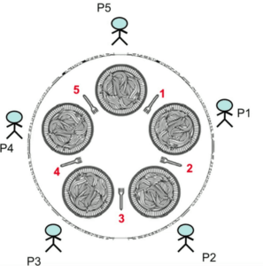

# Java中的餐饮哲学家问题

## 1.简介
餐饮哲学家问题是经典问题之一，用于描述多线程环境中的同步问题并说明解决这些问题的技术。 Dijkstra首先提出了这个问题，并提出了有关访问磁带机外围设备的计算机的问题。

本公式由Tony Hoare给出，他也以发明快速排序排序算法而闻名。 在本文中，我们将分析这个众所周知的问题并编写一个流行的解决方案。

## 2.问题

上图显示了该问题。 在圆桌旁坐着五个沉默的哲学家（P1-P5），他们一生都在吃东西和思考。



为了供他们共享（1-5个）和可以吃的五把叉子，一个哲学家需要双手叉。 吃完饭后，他把它们都放下，然后可以由另一位哲学家挑选，他们重复同样的周期。

> 目的是提出一种方案/协议，以帮助哲学家实现进食和思考的目标，而不会饿死。

## 3.解决方案
最初的解决方案是让每个哲学家都遵循以下协议：

```
while(true) { 
    // Initially, thinking about life, universe, and everything
    think();
 
    // Take a break from thinking, hungry now
    pick_up_left_fork();
    pick_up_right_fork();
    eat();
    put_down_right_fork();
    put_down_left_fork();
 
    // Not hungry anymore. Back to thinking!
}
```

正如上面的伪代码所描述的，每个哲学家最初都在思考。 经过一定时间后，哲学家感到饥饿并希望吃饭。

在这一点上，他伸手去拿叉子，一旦拿到了它们，就开始吃饭。 吃完饭后，哲学家便放下叉子，以便他的邻居可以使用。

## 4.实现
我们将每个哲学家建模为实现Runnable接口的类，以便我们可以将其作为单独的线程运行。每个哲学家均可在其左右两侧使用两个叉子：

```java
public class Philosopher implements Runnable {
 
    // The forks on either side of this Philosopher 
    private Object leftFork;
    private Object rightFork;
 
    public Philosopher(Object leftFork, Object rightFork) {
        this.leftFork = leftFork;
        this.rightFork = rightFork;
    }
 
    @Override
    public void run() {
        // Yet to populate this method
    }
 
}
```

我们还有一种方法可以指导哲学家执行一项操作–吃，思考或获取叉子以准备吃：

```java
public class Philosopher implements Runnable {
 
    // Member variables, standard constructor
 
    private void doAction(String action) throws InterruptedException {
        System.out.println(
          Thread.currentThread().getName() + " " + action);
        Thread.sleep(((int) (Math.random() * 100)));
    }
 
    // Rest of the methods written earlier
}
```

如上面的代码所示，通过将调用线程挂起一段随机的时间来模拟每个动作，这样就不会仅靠时间来强制执行顺序。

现在，让我们实现哲学家的核心逻辑。

为了模拟获取叉子，我们需要将其锁定，以便没有两个Philosopher线程同时获取它。为此，我们使用

````
这个方案恰好实现了前面描述的方案：
哲学家思考了一段时间然后决定吃饭。
此后，他获得左右叉，开始进食。
完成后，他将叉子放下。
我们还为每个操作添加了时间戳，这将有助于我们了解事件发生的顺序。
````


为此，我们使用synchronized关键字获取fork对象的内部监视器，并阻止其他线程执行此操作。可以在这里找到Java中的synchronized关键字的指南。现在，我们继续在Philosopher类中实现run（）方法：

```java
public class Philosopher implements Runnable {
 
   // Member variables, methods defined earlier
 
    @Override
    public void run() {
        try {
            while (true) {    
                // thinking
                doAction(System.nanoTime() + ": Thinking");
                synchronized (leftFork) {
                    doAction(
                      System.nanoTime() 
                        + ": Picked up left fork");
                    synchronized (rightFork) {
                        // eating
                        doAction(
                          System.nanoTime() 
                            + ": Picked up right fork - eating"); 
                         
                        doAction(
                          System.nanoTime() 
                            + ": Put down right fork");
                    }  
                    // Back to thinking
                    doAction(
                      System.nanoTime() 
                        + ": Put down left fork. Back to thinking");
                }
            }
        } catch (InterruptedException e) {
            Thread.currentThread().interrupt();
            return;
        }
    }
}
```

这个方案恰好实现了前面描述的方案：哲学家思考了一段时间然后决定吃饭。

此后，他获得左右叉，开始进食。完成后，他将叉子放下。我们还为每个操作添加了时间戳，这将有助于我们了解事件发生的顺序。

为了启动整个过程，我们编写了一个客户端，该客户端创建5位哲学家作为线程并启动所有这些人：

```java
 @Test
public void testPhilosopher_dead_lock() {
    Philosopher[] philosophers = new Philosopher[5];
    Object[] forks = new Object[philosophers.length];

    for (int i = 0; i < forks.length; i++) {
        forks[i] = new Object();
    }

    for (int i = 0; i < philosophers.length; i++) {
        Object leftFork = forks[i];
        Object rightFork = forks[(i + 1) % forks.length];

        philosophers[i] = new Philosopher(leftFork, rightFork);

        Thread t
            = new Thread(philosophers[i], "Philosopher " + (i + 1));
        t.start();
    }
}
```

我们将每个fork建模为通用Java对象，并使其与哲学家一样多。我们向每个哲学家传递他的左叉和右叉，他尝试使用synced关键字锁定。

运行此代码将产生类似于以下内容的输出。您的输出很可能与以下给出的输出不同，主要是因为sleep（）方法在不同的时间间隔被调用：

```
Philosopher 1 8038014601251: Thinking
Philosopher 2 8038014828862: Thinking
Philosopher 3 8038015066722: Thinking
Philosopher 4 8038015284511: Thinking
Philosopher 5 8038015468564: Thinking
Philosopher 1 8038016857288: Picked up left fork
Philosopher 1 8038022332758: Picked up right fork - eating
Philosopher 3 8038028886069: Picked up left fork
Philosopher 4 8038063952219: Picked up left fork
Philosopher 1 8038067505168: Put down right fork
Philosopher 2 8038089505264: Picked up left fork
Philosopher 1 8038089505264: Put down left fork. Back to thinking
Philosopher 5 8038111040317: Picked up left fork
```

所有的哲学家最初都从思考开始，我们看到哲学家1继续拿起左右叉，然后进食并继续将它们放下，然后“哲学家5”将其拾起。

## 5.解决方案的问题：死锁
尽管上述解决方案似乎是正确的，但是仍然存在死锁的问题。

死锁是指当每个进程都在等待获取某个其他进程所拥有的资源时，系统的进程被暂停的情况。

我们可以通过多次运行上面的代码并检查几次代码是否挂起来确认相同的结果。以下是示例输出，演示了上述问题：

```
Philosopher 1 8487540546530: Thinking
Philosopher 2 8487542012975: Thinking
Philosopher 3 8487543057508: Thinking
Philosopher 4 8487543318428: Thinking
Philosopher 5 8487544590144: Thinking
Philosopher 3 8487589069046: Picked up left fork
Philosopher 1 8487596641267: Picked up left fork
Philosopher 5 8487597646086: Picked up left fork
Philosopher 4 8487617680958: Picked up left fork
Philosopher 2 8487631148853: Picked up left fork
```

在这种情况下，每个哲学家都已经获得了他的左叉，但是不能获得他的右叉，因为他的邻居已经获得了。这种情况通常称为循环等待，是导致死锁并阻止系统前进的条件之一。

## 6.解决僵局
正如我们在上面看到的，发生死锁的主要原因是循环等待条件，其中每个进程都等待其他进程持有的资源。因此，为了避免出现死锁情况，我们需要确保循环等待条件被打破。有多种方法可以实现此目的，最简单的方法如下：

> 所有哲学家都首先伸手去拿左叉，除了首先伸手去拿右叉的人。

我们通过在代码中进行相对较小的更改来在现有代码中实现这一点：

```java
@Test
public void testPhilosopher() {
    Philosopher[] philosophers = new Philosopher[5];
    Object[] forks = new Object[philosophers.length];

    for (int i = 0; i < forks.length; i++) {
        forks[i] = new Object();
    }

    for (int i = 0; i < philosophers.length; i++) {

        Object leftFork = forks[i];//0 1 2 3 4
        Object rightFork = forks[(i + 1) % forks.length];//1 2 3 4 0

        if (i == philosophers.length - 1) {
            philosophers[i] = new Philosopher(rightFork, leftFork); // The last philosopher picks up the right fork first
        } else {
            philosophers[i] = new Philosopher(leftFork, rightFork);
        }

        Thread t = new Thread(philosophers[i], "Philosopher " + (i + 1));
        t.start();
    }
}
```


上面的代码在第17-19行中进行了更改，在这里我们引入了使最后一个哲学家首先到达其右叉而不是左叉的条件。这打破了循环等待条件，我们可以避免死锁。

以下输出显示了其中所有哲学家都有机会思考和进食而不会造成僵局的情况之一：

```
Philosopher 1 88519839556188: Thinking
Philosopher 2 88519840186495: Thinking
Philosopher 3 88519840647695: Thinking
Philosopher 4 88519840870182: Thinking
Philosopher 5 88519840956443: Thinking
Philosopher 3 88519864404195: Picked up left fork
Philosopher 5 88519871990082: Picked up left fork
Philosopher 4 88519874059504: Picked up left fork
Philosopher 5 88519876989405: Picked up right fork - eating
Philosopher 2 88519935045524: Picked up left fork
Philosopher 5 88519951109805: Put down right fork
Philosopher 4 88519997119634: Picked up right fork - eating
Philosopher 5 88519997113229: Put down left fork. Back to thinking
Philosopher 5 88520011135846: Thinking
Philosopher 1 88520011129013: Picked up left fork
Philosopher 4 88520028194269: Put down right fork
Philosopher 4 88520057160194: Put down left fork. Back to thinking
Philosopher 3 88520067162257: Picked up right fork - eating
Philosopher 4 88520067158414: Thinking
Philosopher 3 88520160247801: Put down right fork
Philosopher 4 88520249049308: Picked up left fork
Philosopher 3 88520249119769: Put down left fork. Back to thinking
```

可以通过多次运行代码来验证，该系统不会遇到之前发生的死锁情况。

## 7.结论
在本文中，我们探讨了著名的进餐哲学家问题以及循环等待和死锁的概念。我们编写了一个导致死锁的简单解决方案，并做了简单的更改以打破循环等待并避免死锁。这只是一个开始，确实存在更复杂的解决方案。

可以[在GitHub上](https://github.com/tomlxq/tutorials/tree/master/spring-concurrent-modules/core-java-concurrency-advanced)找到本文的代码。