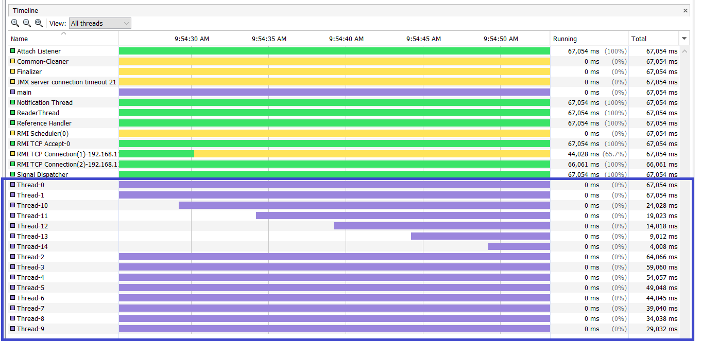
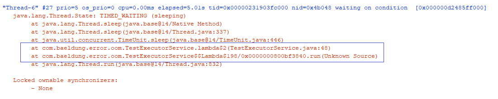

# 是什么原因导致`java.lang.OutOfMemoryError: unable to create new native thread`

## 1. 简介
在本教程中，我们将讨论java.lang.OutOfMemoryError的原因和可能的解决方法：`java.lang.OutOfMemoryError: unable to create new native thread`。

## 2. 了解问题
### 2.1 问题原因
大多数Java应用程序本质上都是多线程的，由多个组件组成，执行特定的任务，并在不同的线程中执行。但是，底层操作系统（OS）限制了Java应用程序可以创建的最大线程数。


当JVM向基础OS询问新线程时，JVM抛出无法创建新的本机线程错误，并且该OS无法创建新的内核线程（也称为OS或系统线程）。事件的顺序如下：

* 在Java虚拟机（JVM）中运行的应用程序请求新线程
* JVM本机代码向操作系统发送请求以创建新的内核线程
* 操作系统尝试创建需要内存分配的新内核线程
* 操作系统拒绝本机内存分配，因为
  * 请求的Java进程耗尽了其内存地址空间
  * 操作系统已耗尽其虚拟内存

然后，Java进程返回`java.lang.OutOfMemoryError：unable to create new native thread`

### 2.2  线程分配模型
操作系统通常具有两种类型的线程–用户线程（由Java应用程序创建的线程）和内核线程。 用户线程在内核线程之上受支持，并且内核线程由OS管理。

它们之间存在三种常见的关系：

* 多对一–许多用户线程映射到单个内核线程
* 一对一–一个用户线程映射到一个内核线程
* 多对多–许多用户线程多路复用到更少或相等数量的内核线程

## 3.重现错误
通过在连续循环中创建线程，然后让线程等待，我们可以轻松地重新创建此问题：

```java
while (true) {
    new Thread(() -> {
        try {
            TimeUnit.HOURS.sleep(1);
        } catch (InterruptedException e) {
            e.printStackTrace();
        }
    }).start();
}
```

由于我们在每个线程上坚持一个小时，同时不断创建新线程，因此我们将迅速从操作系统中获取最大线程数。

## 4.解决方案
解决此错误的一种方法是在操作系统级别上增加线程限制配置。

但是，这不是理想的解决方案，因为OutOfMemoryError可能表示编程错误。 让我们看看解决此问题的其他方法。

### 4.1 利用执行器服务框架
利用Java的执行程序服务框架进行线程管理可以在一定程度上解决此问题。默认执行程序服务框架或自定义执行程序配置可以控制线程的创建。

我们可以使用Executors＃newFixedThreadPool方法来设置一次可以使用的最大线程数：

```java
@Test
public void givenAnExecutorService_WhenMoreTasksSubmitted_ThenAdditionalTasksWait() {

    // Given
    int noOfThreads = 5;
    ExecutorService executorService = Executors.newFixedThreadPool(noOfThreads);
    Runnable runnableTask = () -> {
        try {
            TimeUnit.HOURS.sleep(1);
        } catch (InterruptedException e) {
            e.printStackTrace();
        }
    };

    // When
    IntStream.rangeClosed(1, 10)
        .forEach(i -> executorService.submit(runnableTask));

    // Then
    assertThat(((ThreadPoolExecutor) executorService).getQueue()
        .size(), is(equalTo(5)));
}
```

在上面的示例中，我们首先创建一个包含五个线程的固定线程池和一个可运行任务，该任务使线程等待一小时。然后，我们向线程池提交十个此类任务，并断言在执行程序服务队列中有五个任务正在等待。


由于线程池有五个线程，因此它可以随时最多处理五个任务。

### 4.2 捕获并分析线程转储
捕获和分析线程转储对于了解线程状态非常有用。

让我们看一个示例线程转储，看看我们可以学到什么：




上面的线程快照来自Java VisualVM，用于前面介绍的示例。该快照清楚地说明了连续的线程创建。

一旦确定存在连续的线程创建，就可以捕获应用程序的线程转储，以标识创建线程的源代码：




在上面的快照中，我们可以识别负责线程创建的代码。这为采取适当措施提供了有用的见识。

## 5. 结论
在本文中，我们了解了java.lang.OutOfMemoryError：无法创建新的本机线程错误，并且我们看到这是由Java应用程序中过多的线程创建引起的。

通过将ExecutorService框架和线程转储分析视为解决此问题的两种有用措施，我们探索了一些解决和分析错误的解决方案。

与往常一样，可以在GitHub上获得本文的源代码。