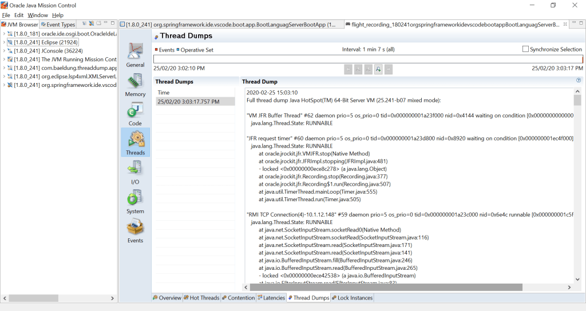
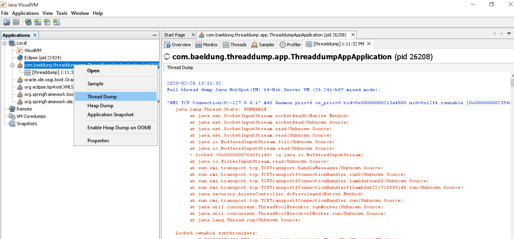
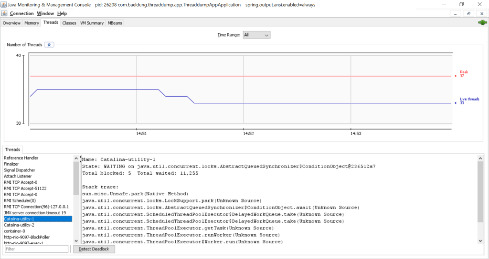

# 捕获Java线程转储

## 1.概述
在本教程中，我们将讨论捕获Java应用程序的线程转储的各种方法。

线程转储是Java进程所有线程状态的快照。 每个线程的状态都带有堆栈跟踪，显示了线程堆栈的内容。 线程转储显示线程的活动，对于诊断问题很有用。 线程转储以纯文本形式编写，因此我们可以将其内容保存到文件中，并稍后在文本编辑器中对其进行查看。


在下一节中，我们将介绍多种工具和方法来生成线程转储。

## 2.使用JDK实用程序
JDK提供了一些实用程序，可以捕获Java应用程序的线程转储。 所有实用程序都位于JDK主目录内的bin文件夹下。 因此，只要此目录在我们的系统路径中，我们就可以从命令行执行这些实用程序。

### 2.1 jstack
jstack是一个命令行JDK实用程序，可用于捕获线程转储。 它获取进程的pid，并在控制台中显示线程转储。 或者，我们可以将其输出重定向到文件。

让我们看一下使用jstack捕获线程转储的基本命令语法：

`jstack [-F] [-l] [-m] <pid>`
所有标志都是可选的。 让我们看看它们的含义：

* -F选项强制执行线程转储； 当jstack pid不响应（进程已挂起）时，方便使用
* -l选项指示实用程序在堆中查找可拥有的同步器并锁定
* -m选项除了打印Java堆栈框架外，还打印本机堆栈框架（C＆C ++）

让我们通过捕获线程转储并将结果重定向到文件来使用这些知识：
`jstack 17264 > /tmp/threaddump.txt`
请记住，我们可以使用jps命令轻松获取Java进程的pid。

### 2.2 Java任务控制
[Java Mission Control（JMC）](https://docs.oracle.com/javacomponents/jmc-5-5/jmc-user-guide/intro.htm#JMCCI109)是一个GUI工具，可从Java应用程序收集和分析数据。 启动JMC后，它将显示在本地计算机上运行的Java进程的列表。 我们还可以通过JMC连接到远程Java进程。

我们可以右键单击该过程，然后单击“Start Flight Recording”选项。 之后，“线程”选项卡显示“线程转储”：



下载：

https://www.oracle.com/technetwork/java/javase/downloads/jmc7-downloads-5868868.html

### 2.3 jvisualvm
[jvisualvm](https://docs.oracle.com/javase/8/docs/technotes/tools/unix/jvisualvm.html)是带有图形用户界面的工具，可让我们监视Java应用程序，对其进行故障排除和分析。 GUI很简单，但是非常直观并且易于使用。


它的众多选项之一使我们能够捕获线程转储。 如果我们右键单击Java进程并选择“ Thread Dump”选项，该工具将创建一个线程转储并在新选项卡中将其打开：



### 2.4 jcmd
jcmd是一种通过向JVM发送命令请求来工作的工具。 尽管功能强大，但它不包含任何远程功能-我们必须在运行Java进程的同一台计算机上使用它。

它的许多命令之一是Thread.print。 我们可以通过指定进程的pid来使用它来获取线程转储：

`jcmd 17264 Thread.print`

### 2.5 jconsole
[jconsole](https://docs.oracle.com/javase/7/docs/technotes/guides/management/jconsole.html)让我们检查每个线程的堆栈跟踪。 如果打开jconsole并连接到正在运行的Java进程，则可以导航至“线程”选项卡并找到每个线程的堆栈跟踪：



### 2.6 总结
事实证明，有很多方法可以使用JDK实用程序捕获线程转储。 让我们花点时间反思一下，并概述一下它们的优缺点：

* jstack：提供捕获线程转储的最快，最简单的方法。 但是，从Java 8开始可以使用更好的替代方法
* jmc：增强的JDK分析和诊断工具。 它将性能分析工具通常存在的性能开销降至最低
* jvisualvm：具有出色的GUI控制台的轻量级开源分析工具
* jcmd：非常强大，建议用于Java 8及更高版本。 一个具有多种用途的工具-捕获线程转储（jstack），堆转储（jmap），系统属性和命令行参数（jinfo）
* jconsole：让我们检查线程堆栈跟踪信息

## 3.从命令行
在企业应用服务器中，出于安全原因，仅安装JRE。因此，我们不能使用上述实用程序，因为它们是JDK的一部分。但是，有多种命令行替代方法可以让我们轻松捕获线程转储。

### 3.1 `kill -3`命令（Linux / Unix）
在类Unix系统中捕获线程转储的最简单方法是通过kill命令，我们可以使用kill命令通过kill（）系统调用将信号发送给进程。在此用例中，我们将其发送给-3信号。

使用前面示例中的pid，让我们看一下如何使用kill捕获线程转储：

`kill -3 17264`
### 3.2 Ctrl + Break（Windows）
在Windows操作系统中，我们可以使用CTRL和Break键组合捕获线程转储。要进行线程转储，请导航至用于启动Java应用程序的控制台，然后同时按CTRL和Break键。

值得注意的是，在某些键盘上，Break键不可用。因此，在这种情况下，可以同时使用CTRL，SHIFT和Pause键捕获线程转储。

这两个命令都将线程转储打印到控制台。

## 4.以编程方式使用ThreadMxBean
我们将在本文中讨论的最后一种方法是使用JMX。我们将使用ThreadMxBean捕获线程转储。让我们在代码中看到它：

```java
private static String threadDump(boolean lockedMonitors, boolean lockedSynchronizers) {
    StringBuffer threadDump = new StringBuffer(System.lineSeparator());
    ThreadMXBean threadMXBean = ManagementFactory.getThreadMXBean();
    for(ThreadInfo threadInfo : threadMXBean.dumpAllThreads(lockedMonitors, lockedSynchronizers)) {
        threadDump.append(threadInfo.toString());
    }
    return threadDump.toString();
}
```

在以上程序中，我们执行几个步骤：

1. 首先，初始化一个空的StringBuffer来保存每个线程的堆栈信息。
2. 然后，我们使用ManagementFactory类获取ThreadMxBean的实例。 ManagementFactory是一种工厂类，用于获取Java平台的托管bean。另外，ThreadMxBean是JVM线程系统的管理接口。
3. 将lockedMonitors和lockedSynchronizers值设置为true表示要捕获线程转储中可拥有的同步器和所有锁定的监视器。

## 5.结论
在本文中，我们展示了多种捕获线程转储的方法。

首先，我们讨论了各种JDK实用程序，然后讨论了命令行替代方法。在上一节中，我们总结了使用JMX的编程方法。

与往常一样，该示例的完整源代码可[在GitHub上](https://github.com/tomlxq/tutorials/tree/master/core-java-modules/core-java-perf)获得。