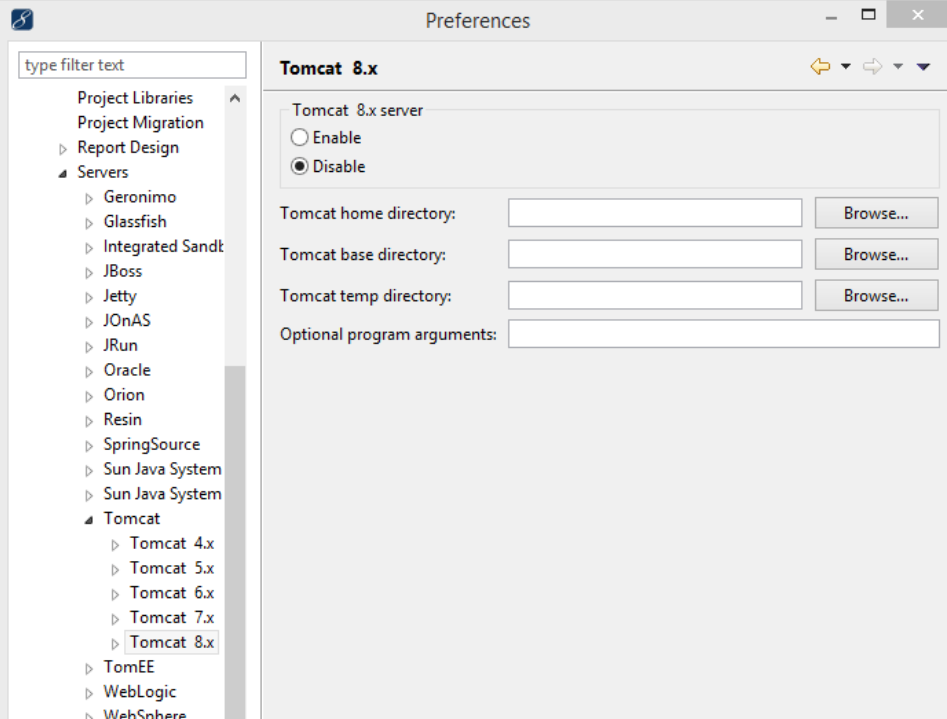
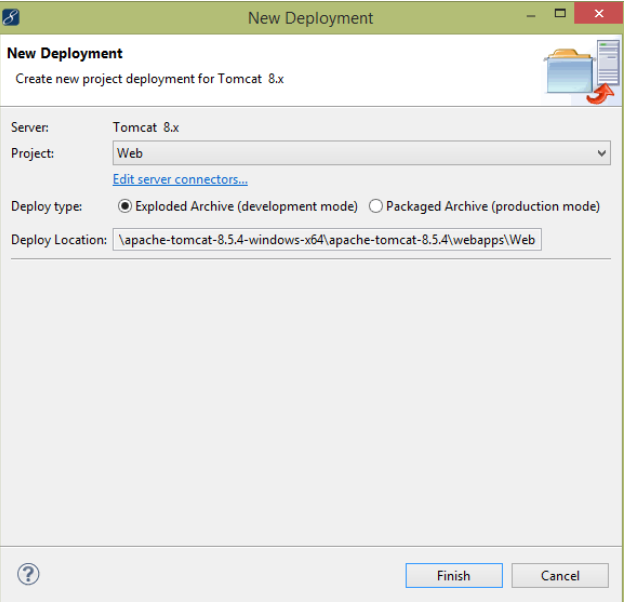

# 如何将WAR文件部署到Tomcat

## 1. 概述
[Apache Tomcat](https://tomcat.apache.org/)是Java社区中最受欢迎的Web服务器之一。 它作为Servlet容器提供，可以通过WAR扩展服务Web ARchives。

它提供了一个管理仪表板，您可以从中部署新的Web应用程序，也可以取消部署现有的Web应用程序而不必重新启动容器。 这在生产环境中特别有用。


在本文中，我们将快速概述Tomcat，然后介绍各种部署WAR文件的方法。

## 2. Tomcat结构
在开始之前，我们应该熟悉一些术语和环境变量。

### 2.1 环境变量
如果您以前使用过Tomcat，那么您将对它们非常熟悉：

`$CATALINA_HOME`

该变量指向我们服务器的安装目录。

`$CATALINA_BASE`

此变量指向Tomcat特定实例的目录，您可能已安装了多个实例。 如果未显式设置此变量，则将为其分配与`$CATALINA_HOME`相同的值。

Web应用程序部署在`$CATALINA_HOME\webapps`目录下。

```
cat /etc/profile
export CATALINA_HOME=/opt/tomcat/apache-tomcat-9.0.19
```

### 2.2 术语
Document Root文件根目录。 引用Web应用程序的顶级目录，所有应用程序资源都位于该目录中，例如JSP文件，HTML页面，Java类和图像。

Context Path上下文路径。 指相对于服务器地址的位置，代表Web应用程序的名称。

例如，如果我们的Web应用程序放在`$CATALINA_HOME\webapps\myapp`目录下，则可以通过URL `http://localhost/myapp`访问它，其上下文路径为`/myapp`。

WAR。 是文件的扩展名，它以ZIP格式打包Web应用程序目录层次结构，并且是Web Archive的缩写。 Java Web应用程序通常打包为WAR文件以进行部署。 这些文件可以在命令行上创建，也可以使用Eclipse之类的IDE创建。

部署我们的WAR文件后，Tomcat将其解压缩并将所有项目文件存储在webapps目录中以该项目命名的新目录中。

## 3. Tomcat设置
Tomcat Apache Web服务器是免费软件，可以[从其网站下载](https://tomcat.apache.org/)。 要求用户计算机上有一个JDK可用，并且JAVA_HOME环境变量的设置正确。

### 3.1 启动Tomcat
我们只需运行`$CATALINA_HOME\bin\startup`中的启动脚本即可启动Tomcat服务器。 每个安装中都有一个.bat和.sh。

根据您使用的是Windows还是Unix操作系统，选择适当的选项。

```
 sh $CATALINA_HOME/bin/shutdown.sh
 sh $CATALINA_HOME/bin/startup.sh
```

### 3.2 配置角色
在部署阶段，我们将提供一些选项，其中之一是使用Tomcat的管理仪表板。 要访问此仪表板，我们必须为管理员用户配置适当的角色。

要访问仪表板，管理员用户需要具有manager-gui角色。 稍后，我们将需要使用Maven部署WAR文件，为此，我们也需要使用经理脚本角色。

让我们在`$CATALINA_HOME\conf\tomcat-users`中进行以下更改：

````
<role rolename="manager-gui"/>
<role rolename="manager-script"/>
<user username="admin" password="password" roles="manager-gui, manager-script"/>
````

通过以下官方链接可以找到[有关不同Tomcat角色的更多详细信息](https://tomcat.apache.org/tomcat-6.0-doc/manager-howto.html)。

### 3.3 设置目录权限
最后，确保对Tomcat安装目录具有读/写权限。

### 3.4 测试安装
要测试Tomcat的设置是否正确，请运行启动脚本（startup.bat / startup.sh），如果控制台上未显示任何错误，我们可以通过访问`http://localhost:8080`进行仔细检查。

如果您看到Tomcat登陆页面，则表明我们已正确安装服务器。

### 3.5 解决端口冲突
默认情况下，Tomcat设置为侦听端口8080上的连接。如果已经有另一个应用程序绑定到该端口，启动控制台将告知我们。

要更改端口，我们可以编辑位于`$CATALINA_HOME\conf\server.xml`的服务器配置文件server.xml。 默认情况下，连接器配置如下：

`<Connector port="8080" protocol="HTTP/1.1" 
  connectionTimeout="20000" redirectPort="8443" />`
例如，如果要将端口更改为8081，则必须更改连接器的port属性，如下所示：

`<Connector port="8081" protocol="HTTP/1.1" 
  connectionTimeout="20000" redirectPort="8443" />`
有时，我们选择的端口默认情况下不会处于打开状态，在这种情况下，我们将需要在Unix内核中使用适当的命令或在Windows中创建适当的防火墙规则来打开此端口，这超出了本书的范围 本文。

## 4. 从Maven部署
如果要使用Maven部署Web存档，则必须在Maven的settings.xml文件中将Tomcat配置为服务器。

在两个位置可以找到settings.xml文件：

Maven安装：`${maven.home}/conf/settings.xml`
用户的安装：`${user.home}/.m2/settings.xml`
找到它后，添加Tomcat，如下所示：

```xml
<server>
    <id>TomcatServer</id>
    <username>admin</username>
    <password>password</password>
</server>
```

现在，我们需要从Maven创建一个基本的Web应用程序以测试部署。让我们导航到我们想要创建应用程序的位置。

在控制台上运行以下命令以创建新的Java Web应用程序：

`mvn archetype:generate -DgroupId=com.tom -DartifactId=tomcat-war-deployment -DarchetypeArtifactId=maven-archetype-webapp -DinteractiveMode=false`
这将在tomcat-war-deployment目录中创建一个完整的Web应用程序，如果我们现在进行部署并通过浏览器进行访问，它会显示hello world!。

但是在执行此操作之前，我们需要进行一次更改以启用Maven部署。因此，转到pom.xml并添加以下插件：

```xml
<build> 
  <finalName>tomcat-war-deployment</finalName>  
  <plugins> 
    <plugin> 
      <groupId>org.apache.tomcat.maven</groupId>  
      <artifactId>tomcat7-maven-plugin</artifactId>  
      <version>2.2</version>  
      <configuration> 
        <url>http://localhost:8080/manager/text</url>  
        <server>TomcatServer</server>  
        <path>/myapp</path> 
      </configuration> 
    </plugin> 
  </plugins> 
</build>
```

请注意，我们使用的是Tomcat 7插件，因为它可同时用于版本7和版本8，而无需进行任何特殊更改。

配置URL是我们将部署发送到的URL，Tomcat将知道如何处理它。 server元素是Maven识别的服务器实例的名称。最后，path元素定义了我们部署的上下文路径。

这意味着，如果我们的部署成功，我们将通过单击`http://localhost:8080/myapp`访问Web应用程序。

现在我们可以从Maven运行以下命令。

部署Web应用程序：

`mvn tomcat7:deploy`
取消部署：

`mvn tomcat7:undeploy`
进行更改后重新部署：

`mvn tomcat7:redeploy`

## 5. 使用Cargo插件进行部署
Cargo是一个多功能库，可让我们以标准方式操纵各种类型的应用程序容器。

### 5.1 Cargo部署设置
在本节中，我们将研究如何使用Cargo的Maven插件将WAR部署到Tomcat，在这种情况下，我们将其部署到版本7实例。


为了牢牢掌握整个过程，我们将从头开始，从命令行创建一个新的Java Web应用程序：

`mvn archetype:generate -DgroupId=com.tom -DartifactId=cargo-deploy -DarchetypeArtifactId=maven-archetype-webapp -DinteractiveMode=false`
这将在cargo-deploy目录中创建一个完整的Java Web应用程序。如果我们按原样构建，部署和加载该应用程序，它将打印Hello World！在浏览器中。

与Tomcat7 Maven插件不同，Cargo Maven插件要求该文件存在。

由于我们的Web应用程序不包含任何servlet，因此我们的web.xml文件将非常基础。因此，导航到我们新创建的项目的WEB-INF文件夹，并创建具有以下内容的web.xml文件：

```xml
<?xml version="1.0" encoding="UTF-8"?>
<web-app xmlns:xsi="http://www.w3.org/2001/XMLSchema-instance" 
  xmlns="http://java.sun.com/xml/ns/javaee" 
    xsi:schemaLocation="http://java.sun.com/xml/ns/javaee 
      http://java.sun.com/xml/ns/javaee/web-app_3_0.xsd" 
        id="WebApp_ID" version="3.0">
 
    <display-name>cargo-deploy</display-name>
    <welcome-file-list>
        <welcome-file>index.jsp</welcome-file>
    </welcome-file-list>
</web-app>
```

为了使Maven无需输入标准名称即可识别Cargo的命令，我们需要将Cargo Maven插件添加到Maven的settings.xml中的插件组中。

作为根`<settings></settings>`元素的直接子代，添加以下内容：

```xml
<pluginGroups>
    <pluginGroup>org.codehaus.cargo</pluginGroup>
</pluginGroups>
```

### 5.2 本地部署
在本小节中，我们将编辑pom.xml以适合我们的新部署要求。

如下添加插件：

```xml
<build> 
  <finalName>cargo-deploy</finalName>  
  <plugins> 
    <plugin> 
      <groupId>org.codehaus.cargo</groupId>  
      <artifactId>cargo-maven2-plugin</artifactId>  
      <version>1.7.9</version>  
      <configuration>
    <container>
        <containerId>tomcat9x</containerId>
        <type>remote</type>
    </container>
    <configuration>
        <type>runtime</type>
        <properties>
            <cargo.remote.username>admin</cargo.remote.username>
            <cargo.remote.password>admin</cargo.remote.password>
            <cargo.tomcat.manager.url>http://192.168.238.150:20000/manager/text
              </cargo.tomcat.manager.url>
        </properties>
    </configuration>
</configuration>
    </plugin> 
  </plugins> 
</build>
```

在撰写本文时，最新版本为1.7.9。但是，始终可以在此处找到最新版本。

请注意，我们将包装明确定义为WAR，否则，构建将失败。然后，在“插件”部分中，添加cargo Maven2插件。另外，我们添加了一个配置部分，告诉我们Maven我们正在使用Tomcat容器以及现有的安装。

通过将容器类型设置为已安装，我们告诉Maven我们已经在计算机上安装了一个实例，并且为该安装提供了绝对URL。


通过将配置类型设置为现存，我们告诉Tomcat我们已经使用了现存的设置，不需要进一步的配置。

替代方法是告诉货物下载并设置提供URL的版本。但是，我们的重点是WAR部署。

值得注意的是，无论我们使用的是Maven 2.x还是Maven 3.x，cargo maven2插件都可同时使用。

现在，我们可以通过执行以下命令安装应用程序：

`mvn install`
并通过以下方式进行部署：

`mvn cargo:deploy`
如果一切顺利，我们应该可以通过加载`http://localhost:8080/cargo-deploy`来运行我们的Web应用程序。

### 5.3 远程部署
要进行远程部署，我们只需要更改pom.xml的配置部分。远程部署意味着我们没有本地安装的Tomcat，但可以访问远程服务器上的管理器仪表板。

因此，让我们更改pom.xml，以便配置部分如下所示：

```
<configuration>
    <container>
        <containerId>tomcat8x</containerId>
        <type>remote</type>
    </container>
    <configuration>
        <type>runtime</type>
        <properties>
            <cargo.remote.username>admin</cargo.remote.username>
            <cargo.remote.password>admin</cargo.remote.password>
            <cargo.tomcat.manager.url>http://localhost:8080/manager/text</cargo.tomcat.manager.url>
        </properties>
    </configuration>
</configuration>
```

这次，我们将容器类型从安装更改为远程，将配置类型从现有更改为运行。最后，我们向配置添加身份验证和远程URL属性。

确保角色和用户与以前一样已经存在于`$CATALINA_HOME/conf/tomcat-users.xml`中。

如果要编辑同一项目以进行远程部署，请首先取消部署现有的WAR：

`mvn cargo:undeploy`
清理项目：

`mvn clean`
安装它：

`mvn install`
最后，部署它：

`mvn cargo:deploy`
而已。

## 6.从Eclipse部署
Eclipse允许我们嵌入服务器以在常规工作流中添加Web项目部署，而无需离开IDE。

### 6.1 将Tomcat嵌入Eclipse
通过从任务栏选择窗口菜单项，然后从下拉菜单中选择首选项，我们可以将安装嵌入到eclipse中。

我们会在出现的窗口的左侧面板上找到首选项的树状网格。然后，我们可以导航至eclipse->服务器，或仅在搜索栏中键入服务器。

然后，选择安装目录（如果尚未打开的话），然后选择我们下载的Tomcat版本。

在面板的右侧，将出现一个配置页面，我们在其中选择“启用”选项以激活该服务器版本并浏览到安装文件夹。




我们应用更改，下一次从Eclipse的窗口-> show view子菜单中打开服务器视图时，将显示新配置的服务器，我们可以启动，停止和向其部署应用程序。

### 6.2 在嵌入式Tomcat中部署Web应用程序
要将Web应用程序部署到Tomcat，它必须存在于我们的工作空间中。

从窗口->显示视图中打开服务器视图，然后查找服务器。打开后，我们可以右键单击我们配置的服务器，然后从出现的上下文菜单中选择“添加部署”。

 


在出现的“新建部署”对话框中，打开项目下拉菜单，然后选择Web项目。

当我们选择*Deploy* 存档（开发模式）时，在项目组合框下面有一个部署类型部分，我们在应用程序中的更改将实时同步而无需重新部署，这是开发过程中的最佳选择，因为它非常有效。




选择打包的归档文件（生产模式）将要求我们在每次进行更改并在浏览器中查看它们时重新部署。这仅对生产而言是最好的，但是Eclipse使它同样容易。

### 6.3 在外部位置部署Web应用程序
我们通常选择通过Eclipse部署WAR，以简化调试过程。有时候我们可能希望将其部署到Eclipse嵌入式服务器所使用的位置之外的其他位置。最常见的情况是生产服务器在线，而我们想更新Web应用程序。

我们可以通过以下方式绕过此过程：在生产模式下进行部署，并在“新建部署”对话框中注意到“部署位置”，然后从中选择WAR。

在部署期间，除了选择嵌入式服务器外，我们还可以从服务器视图中的嵌入式服务器列表旁边选择<Externally Launched>选项。我们导航到外部Tomcat安装的webapps目录。

## 7.从IntelliJ IDEA部署
要将Web应用程序部署到Tomcat，它必须存在并且已经下载并安装。

### 7.1 本地配置
打开运行菜单，然后单击编辑配置选项。


在左侧面板中搜索Tomcat服务器，如果没有，请单击菜单中的+号，搜索Tomcat并选择本地。 在名称字段中，输入Tomcat 7/8（取决于您的版本）。


单击“配置...”按钮，然后在“ Tomcat主页”字段中导航到安装的本地位置并选择它。

 


（可选）将“启动”页面设置为`*http://localhost:8080/*`和HTTP端口：8080，并根据需要更改端口。

转到Deployment选项卡，然后单击+符号，选择要添加到服务器的工件，然后单击OK。

 


### 7.2 远程配置
遵循与本地Tomcat配置相同的说明，但是在“服务器”选项卡中，必须输入安装的远程位置。

## 8. 通过复制存档进行部署
我们已经看到了如何从Eclipse导出WAR。我们可以做的一件事就是通过将其拖放到任何Tomcat实例的$ CATALINA_HOME \ webapps目录中来进行部署。如果实例正在运行，则部署将立即开始，因为Tomcat解压缩归档文件并配置其上下文路径。

如果实例未在运行，则服务器将在下次启动该项目时对其进行部署。

## 9. 从Tomcat Manager部署
假设我们已经准备好WAR文件，并希望使用管理仪表板进行部署。您可以通过访问`http://localhost:8080/manager`来访问管理器仪表板。

仪表板具有五个不同的部分：管理器，应用程序，部署，诊断和服务器信息。如果转到“部署”部分，将找到两个子部分。

### 9.1 部署服务器上的目录或WAR文件
如果WAR文件位于运行Tomcat实例的服务器上，那么我们可以在必填的Context Path字段中加一个正斜杠“ /”。

假设我们希望使用URL `http://localhost:8080/myapp`从浏览器访问Web应用程序，那么上下文路径字段将包含`/myapp`。

我们跳过XML配置文件URL字段，然后转到WAR或Directory URL字段。在这里，我们输入Web ARchive文件在服务器上显示的绝对URL。假设我们的文件位置为C：/apps/myapp.war，然后输入此位置。不要忘记WAR扩展。

之后，我们可以单击部署按钮。该页面将重新加载，我们应该看到以下消息：

`OK - Deployed application at context path /myapp`
在页面顶部。

此外，我们的应用程序也应该出现在页面的“应用程序”部分中。

### 9.2 要部署的WAR文件
只需单击“选择文件”按钮，导航到WAR文件的位置并选择它，然后单击“部署”按钮。

在两种情况下，如果一切顺利，Tomcat控制台将通过以下消息通知我们部署已成功：

`INFO: Deployment of web application archive \path\to\deployed_war has finished in 4,833 ms`
## 10. 结论
在本文中，我们集中于将WAR部署到Tomcat服务器中。

## Issuers

### 1. tomcat管理页面403 Access Denied的解决方法

安装tomcat，配置好tomcat环境变量以后，访问manager app页面，出现403 Access Denied错误，解决的方法如下：
首先在`conf/tomcat-users.xml`文件里面，在`</tomcat-users>`前面添加如下代码：

```xml
<role rolename="manager-gui"/>
<user password="admin" roles="manager-gui" username="tomcat"/>
```
然后重启tomcat，重新访问manager app页面，如果此时仍然出现403 Access Denied错误，那么就是访问的ip地受到了限制，
我们打开`/webapps/manager/META-INF/`目录下context.xml文件，不是conf/目录下的context.xml文件，一定不要搞错了
我们将里面的内容注释掉或者修改为
```xml
<Valve className="org.apache.catalina.valves.RemoteAddrValve"
allow="127\.\d+\.\d+\.\d+|::1|0:0:0:0:0:0:0:1|\d+\.\d+\.\d+\.\d+" />
```