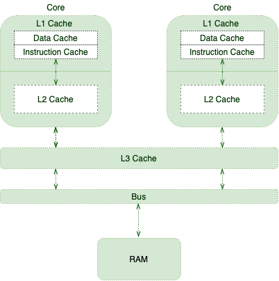
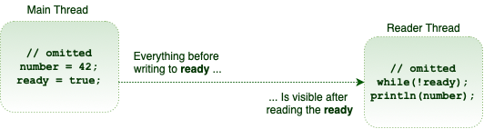

# Java Volatile关键字指南

## 1.概述
在没有必要的同步的情况下，编译器，运行时或处理器可能会应用各种优化。 尽管这些优化在大多数情况下是有益的，但有时它们可能会引起细微的问题。

缓存和重新排序是在并发上下文中可能使我们感到惊讶的优化措施之一。 Java和JVM提供了许多方法来控制内存顺序，而volatile关键字就是其中之一。


在本文中，我们将重点介绍Java语言中这个基本但经常被误解的概念-volatile关键字。 首先，我们将从底层计算机体系结构的工作背景入手，然后再熟悉Java中的内存顺序。

## 2.共享多处理器架构
处理器负责执行程序指令。 因此，他们需要从RAM中检索程序指令和所需的数据。

由于CPU每秒能够执行大量指令，因此从RAM中获取数据并不是理想的选择。 为了改善这种情况，处理器正在使用一些技巧，例如[乱序执行](https://en.wikipedia.org/wiki/Out-of-order_execution)，[分支预测](https://en.wikipedia.org/wiki/Branch_predictor)，[推测执行](https://en.wikipedia.org/wiki/Speculative_execution)，当然还有缓存。

这是以下内存层次结构起作用的地方：




随着不同的内核执行更多的指令并处理更多的数据，它们会用更多相关的数据和指令来填充其缓存。 这将提高整体性能，但以引入[缓存一致性挑战](https://en.wikipedia.org/wiki/Cache_coherence)为代价。

简而言之，我们应该三思而后行一个线程更新缓存的值时会发生什么。

## 3.何时使用Volatile
为了扩展缓存一致性，让我们从《 Java并发实践》一书中借用一个示例：

```JAVA
public class TaskRunner {

    private static int number;
    private volatile static boolean ready;

    private static class Reader extends Thread {

        @Override
        public void run() {
            while (!ready) {
                Thread.yield();
            }

            System.out.println(number);
        }
    }

    public static void main(String[] args) {
        new Reader().start();
        number = 42;
        ready = true;
    }
}
```

TaskRunner类维护两个简单变量。在它的main方法中，它创建另一个线程，只要它为false，就会在ready变量上旋转。当变量变为true时，线程将只打印数字变量。

许多人可能希望此程序在短暂的延迟后仅打印42。但是，实际上，延迟可能会更长。它甚至可能永远挂起，甚至打印为零！

这些异常的原因是缺乏适当的内存可见性和重新排序。让我们对其进行更详细的评估。

### 3.1 内存可视性
在这个简单的示例中，我们有两个应用程序线程：主线程和读取器线程。 让我们想象一下一个场景，其中OS在两个不同的CPU内核上调度这些线程，其中：

主线程在其核心高速缓存中具有ready和number变量的副本
阅读器线程也以其副本结尾
主线程更新缓存的值
在大多数现代处理器上，写请求在发出后不会立即应用。 实际上，处理器倾向于将这些写在特定的写缓冲区中排队。 一段时间后，他们会将这些写入一次全部应用到主存储器。

综上所述，当主线程更新number和ready变量时，无法保证阅读器线程会看到什么。 换句话说，读取器线程可能会立即看到更新的值，或者有些延迟，或者根本看不到！

这种内存可见性可能会在依赖可见性的程序中引起活动性问题。

### 3.2 重新排序
更糟的是，读取器线程可能会以实际程序顺序以外的任何顺序查看这些写入。 例如，由于我们首先更新了number变量：

```java
public static void main(String[] args) { 
    new Reader().start();
    number = 42; 
    ready = true; 
}
```

我们可能希望读取器线程打印42。但是，实际上有可能看到零作为打印值！

重新排序是一种用于提高性能的优化技术。 有趣的是，不同的组件可以应用此优化：

处理器可以按程序顺序以外的任何顺序刷新其写缓冲区
处理器可能会应用乱序执行技术
JIT编译器可以通过重新排序进行优化

### 3.3 Volatile存储器顺序
为了确保变量的更新可预测地传播到其他线程，我们应该对这些变量应用volatile修饰符：

```java
public class TaskRunner {
 
    private volatile static int number;
    private volatile static boolean ready;
 
    // same as before
}
```

这样，我们与运行时和处理器进行通信，以不对任何涉及volatile变量的指令重新排序。 此外，处理器知道应该立即刷新这些变量的所有更新。

## 4.Volatile和线程同步
对于多线程应用程序，我们需要确保一些规则以实现一致的行为：

互斥–一次仅一个线程执行一个关键部分
可见性–一个线程对共享数据所做的更改对其他线程可见，以保持数据一致性
同步的方法和块以应用程序性能为代价提供了上述两个属性。

volatile是一个非常有用的关键字，因为它可以帮助确保数据更改的可见性，而无需提供互斥。 因此，它在可以并行执行多个代码块的多个线程可以使用的地方很有用，但我们需要确保Volatile属性。

## 5.Happens-Before Ordering
Volatile变量的内存可见性影响超出了Volatile变量本身。

更具体地说，假设线程A写入一个volatile变量，然后线程B读取相同的volatile变量。在这种情况下，写入volatile变量之前A可见的值将在读取volatile变量之后B可见：




从技术上讲，任何对易失性字段的写操作都在每次后续读取同一字段之前发生。这是Java内存模型（JMM）的易变变量规则。

### 5.1 Piggybacking
由于在内存排序之前发生事件的强度，有时我们可以背负另一个易失变量的可见性属性。例如，在我们的特定示例中，我们只需要将ready变量标记为volatile即可：

```java
public class TaskRunner {
 
    private static int number; // not volatile
    private volatile static boolean ready;
 
    // same as before
}
```

读取ready变量后，任何对true写入ready变量的内容都是可见的。因此，数字变量搭载在ready变量强制执行的内存可见性上。简而言之，即使它不是可变变量，它也表现出可变行为。

通过使用这些语义，我们只能将类中的几个变量定义为volatile并优化可见性保证。

## 6. 结论
在本教程中，我们探索了关于volatile关键字及其功能的更多信息，以及从Java 5开始对其进行的改进。