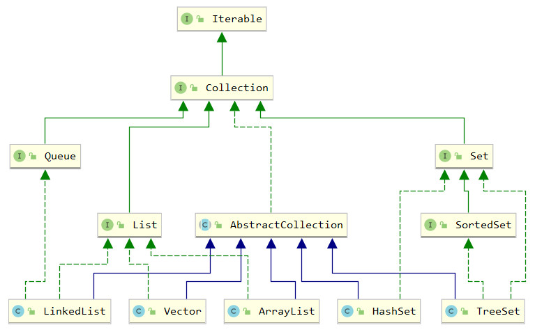
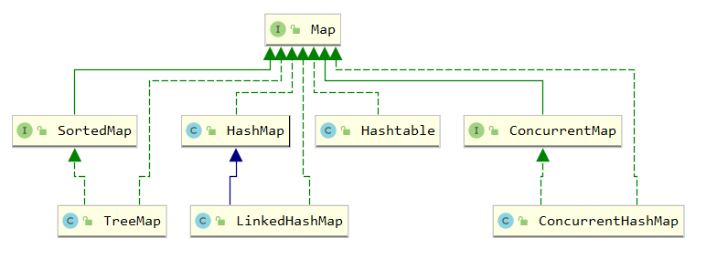
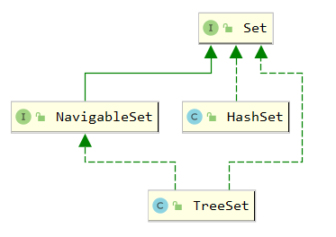

# Java Collections面试问题

## 1.简介
Java Collections是Java开发人员经常在技术采访中提到的一个话题。 本文回顾了一些最常被问到的重要问题，这些问题可能很难弄清。

## 2.问题
### Q1 描述集合类型层次结构。 主要接口是什么，它们之间有什么区别？
Iterable接口表示可以使用for-each循环进行迭代的任何集合。 

Collection接口继承自Iterable，并添加了通用方法来检查元素是否在集合中，从集合中添加和删除元素，确定其大小等。

List，Set和Queue接口从Collection接口继承。

List是一个有序的集合，其元素可以通过列表中的索引进行访问。

Set是具有不同元素的无序集合，类似于集合的数学概念。

队列是一个集合，其中包含用于添加，删除和检查元素的其他方法，这些方法可用于在处理之前保存元素。

Map接口也是集合框架的一部分，但是它没有扩展Collection。 这是设计使然，以强调集合和映射之间的差异，而这些差异在通用抽象下很难收集。 Map接口表示具有唯一键的键值数据结构，每个键的值不超过一个。



### Q2 描述Map接口的各种实现及其用例差异。
HashMap是Map接口最常用的实现之一。它是一种典型的哈希映射数据结构，它允许在恒定时间或O（1）中访问元素，但不保留顺序并且也不是线程安全的。

要保留元素的插入顺序，可以使用LinkedHashMap类，该类扩展了HashMap并另外将这些元素绑定到一个链表中，并且具有可预见的开销。

TreeMap类将其元素存储在红黑树结构中，该结构允许以对数时间或O（log（n））访问元素。在大多数情况下，它比HashMap慢，但是根据某些Comparator，它可以使元素保持顺序。

ConcurrentHashMap是哈希映射的线程安全实现。它提供了检索的完全并发性（因为get操作不需要锁定）和更新的高并发性。


从1.0版开始，Hashtable类就已经在Java中使用。它不被弃用，但通常被认为已过时。它是一个线程安全的哈希映射，但是与ConcurrentHashMap不同，它的所有方法都是简单同步的，这意味着对该映射块的所有操作，甚至是独立值的检索。



### Q3 解释Linkedlist和Arraylist之间的区别。
ArrayList是基于数组的List接口的实现。添加或删除元素时，ArrayList在内部处理此数组的大小调整。您可以通过它们在数组中的索引在恒定时间内访问其元素。但是，插入或删除元素会导致所有后续元素发生移位，如果数组很大并且插入或删除的元素接近列表的开头，则可能会很慢。

LinkedList是一个双向链接列表：将单个元素放入具有对上一个和下一个Node的引用的Node对象中。如果您在列表的不同部分中有很多插入或删除操作，特别是如果列表很大，则此实现可能比ArrayList效率更高。

但是，在大多数情况下，ArrayList的性能优于LinkedList。即使是ArrayList中的元素，尽管是O（n）操作，也可以通过非常快的System.arraycopy（）调用来实现。它的出现甚至比LinkedList的O（1）插入要快，后者需要实例化Node对象并在后台更新多个引用。由于创建了多个小型Node对象，LinkedList也可能具有较大的内存开销。

### Q4 哈希集和树集有什么区别？
HashSet和TreeSet类均实现Set接口并表示不同元素的集合。 此外，TreeSet实现了NavigableSet接口。 该接口定义了利用元素顺序的方法。

HashSet在内部基于HashMap，TreeSet由TreeMap实例支持，该实例定义了它们的属性：HashSet不会以任何特定顺序保留元素。 对HashSet中的元素进行迭代会以随机顺序生成它们。 另一方面，TreeSet根据一些预定义的Comparator顺序生成元素。



### Q5 如何在Java中实现Hashmap？它的实现如何使用哈希码和对象的相等方法？从这样的结构中放置元素的时间复杂度是多少？
HashMap类代表具有某些设计选择的典型哈希Map数据结构。

HashMap由可调整大小的数组支持，该数组的大小为2的幂。将元素添加到HashMap时，首先会计算其hashCode（一个int值）。然后，此值的一定数量的低位用作数组索引。该索引直接指向应放置此**键值对的数组单元**（称为存储桶）。通过元素在数组中的索引访问元素是非常快的O（1）操作，这是哈希映射结构的主要功能。


但是，hashCode不是唯一的，即使对于不同的hashCode，我们也可能会收到相同的数组位置。这称为碰撞。解决哈希Map数据结构中冲突的方法不止一种。在Java的HashMap中，每个存储桶实际上不是指单个对象，而是指向该存储桶中**所有对象的一棵红黑树（在Java 8之前，这是一个链表）**。

因此，当HashMap确定了键的存储桶时，它必须遍历此树以将键值对放置在其位置。如果存储桶中已存在具有此类key的一对，则将其替换为新key。

为了通过其键检索对象，HashMap再次必须计算键的hashCode，找到相应的存储桶，遍历树，在树中的键上调用equals并找到匹配的键。

HashMap具有放置元素和获取元素的O（1）复杂度或恒定时间复杂度。当然，在所有元素都落在单个存储桶中的最坏情况下，大量冲突可能会使性能降低到O（log（n））时间复杂度。通常可以通过提供具有均匀分布的良好哈希函数来解决此问题。

当HashMap内部数组被填充时（在下一个问题中将对此进行详细说明），它会自动调整为两倍大。此操作会导致重新哈希处理（内部数据结构的重建），这很昂贵，因此您应事先计划HashMap的大小。

### Q6 Hashmap的初始容量和负载因子参数的目的是什么？它们的默认值是多少？
HashMap构造函数的initialCapacity参数会影响HashMap的内部数据结构的大小，但是对地图实际大小的推理有些棘手。 HashMap的内部数据结构是一个具有2的幂的数组。因此，initialCapacity参数值将增加到下一个2的幂（例如，如果将其设置为10，则内部数组的实际大小将为16）。

HashMap的负载因子是元素计数除以存储区计数（即内部数组大小）的比率。例如，如果一个16桶的HashMap包含12个元素，则其负载系数为12/16 = 0.75。高负载系数意味着很多碰撞，这又意味着应该将Map调整为下一个2的幂。因此loadFactor参数是映射的负载因子的最大值。当映射达到此负载因子时，它将其内部数组的大小调整为下一个2的幂。

默认情况下，initialCapacity为16，默认情况下，loadFactor为0.75，因此您可以将12个元素放入使用默认构造函数实例化的HashMap中，并且不会调整大小。 HashSet也是如此，它由内部的HashMap实例支持。

因此，提供满足您需求的initialCapacity并非易事。这就是为什么Guava库具有Maps.newHashMapWithExpectedSize（）和Sets.newHashSetWithExpectedSize（）方法的原因，这些方法使您可以构建HashMap或HashSet来容纳期望数量的元素而无需调整大小。

### Q7 描述枚举的特殊Collections。 与常规Collections相比，实施它们有什么好处？
EnumSet和EnumMap分别是Set和Map接口的特殊实现。 在处理枚举时，应始终使用这些实现，因为它们非常有效。


EnumSet只是一个位向量，其位置对应于集合中存在的枚举的有序值的位置为“ 1”。 为了检查枚举值是否在集合中，该实现仅需要检查向量中的对应位是否为“ 1”，这是非常简单的操作。 同样，EnumMap是一个以枚举的序数值作为索引访问的数组。 对于EnumMap，无需计算哈希码或解决冲突。

### Q8 Fail-Fast迭代器和Fail-Safe迭代器之间有什么区别？
不同集合的迭代器是快速失败的还是安全失败的，取决于它们对并发修改的反应。 并发修改不仅是来自另一个线程的集合的修改，而且是来自同一线程的修改，而是使用另一个迭代器或直接修改集合。

快速失败的迭代器（由HashMap，ArrayList和其他非线程安全的集合返回的迭代器）遍历集合的内部数据结构，并在检测到并发修改时立即抛出ConcurrentModificationException。

故障安全迭代器（由诸如ConcurrentHashMap，CopyOnWriteArrayList之类的线程安全集合返回）创建它们所迭代的结构的副本。 它们保证并发修改的安全性。 它们的缺点包括过多的内存消耗，以及在修改集合的情况下对可能过时的数据进行迭代。

### Q9 如何使用Comparable和Comparator接口对集合进行排序？
Comparable接口是对象的接口，可以根据某些顺序进行比较。它的单个方法是compareTo，它对两个值进行操作：对象本身和相同类型的参数对象。例如，Integer，Long和其他数字类型实现此接口。 String还实现了此接口，并且其compareTo方法按字典顺序比较字符串。

Comparable接口允许使用Collections.sort（）方法对相应对象的列表进行排序，并支持实现SortedSet和SortedMap的集合中的迭代顺序。如果可以使用某种逻辑对对象进行排序，则它们应实现Comparable接口。

Comparator接口通常使用元素的自然顺序来实现。例如，所有整数编号从较小的值到较大的值排序。但是有时您可能想要实现另一种排序，例如，以降序对数字进行排序。Comparator接口可以在这里提供帮助。

您要排序的对象的类不需要实现此接口。您只需创建一个实现类并定义比较方法即可接收两个对象并决定如何对它们进行排序。然后，您可以使用此类的实例来替代Collections.sort（）方法或SortedSet和SortedMap实例的自然顺序。

由于Comparator接口是功能接口，因此可以使用lambda表达式替换它，如以下示例所示。它显示了使用自然排序（Integer的Comparable接口）和使用自定义迭代器（Comparator <Integer>接口）对列表进行排序。

```java
@Test
public void custom_comparator() {
    List<Integer> list1 = Arrays.asList(5, 2, 3, 4, 1);
    Collections.sort(list1);
    assertEquals( Integer.valueOf(1), list1.get(0));
    Collections.sort(list1, (a, b) -> b - a);
    assertEquals(Integer.valueOf(5), list1.get(0));
}
```