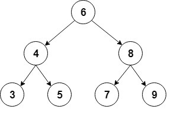

# 用Java实现二叉树

## 1.简介
在本文中，我们将介绍Java中二叉树的实现。

为了本文的方便，我们将使用包含int值的排序二叉树。

## 2.二叉树
二叉树是一种递归数据结构，其中每个节点最多可以有2个子节点。

二进制树的一种常见类型是二进制搜索树，其中每个节点的值都大于或等于左子树中的节点值，并且小于或等于右子树中的节点值。

这是这种二叉树的快速直观表示：




对于实现，我们将使用辅助Node类，该类将存储int值并保留对每个子代的引用：

```java
class Node {
    int value;
    Node left;
    Node right;

    Node(int value) {
        this.value = value;
        right = null;
        left = null;
    }
}
```

然后，让我们添加树的起始节点，通常称为根：

```java
public class BinaryTree {

    Node root;
    // ...
}
```

## 3.常用操作
现在，让我们看看可以对二叉树执行的最常见的操作。

### 3.1 插入元素
我们要介绍的第一个操作是插入新节点。

首先，我们必须找到要添加新节点的位置，以使树保持排序。 我们将从根节点开始遵循以下规则：

如果新节点的值小于当前节点的值，我们转到左子节点
如果新节点的值大于当前节点的值，则转到正确的子节点
当当前节点为null时，我们到达了叶节点，我们可以在该位置插入新节点
首先，我们将创建一个递归方法来执行插入操作：

```java
private Node addRecursive(Node current, int value) {

    if (current == null) {
        return new Node(value);
    }

    if (value < current.value) {
        current.left = addRecursive(current.left, value);
    } else if (value > current.value) {
        current.right = addRecursive(current.right, value);
    }

    return current;
}
```

接下来，我们将创建从根节点开始递归的public方法：

```java
public void add(int value) {
    root = addRecursive(root, value);
}
```

现在，让我们看看如何使用此方法从示例中创建树：

```java
private BinaryTree createBinaryTree() {
    BinaryTree bt = new BinaryTree();

    bt.add(6);
    bt.add(4);
    bt.add(8);
    bt.add(3);
    bt.add(5);
    bt.add(7);
    bt.add(9);

    return bt;
}
```

### 3.2 寻找元素
现在让我们添加一个方法来检查树是否包含特定值。

和以前一样，我们将首先创建遍历树的递归方法：

```java
private boolean containsNodeRecursive(Node current, int value) {
    if (current == null) {
        return false;
    }

    if (value == current.value) {
        return true;
    }

    return value < current.value
            ? containsNodeRecursive(current.left, value)
            : containsNodeRecursive(current.right, value);
}
```

在这里，我们正在通过将其与当前节点中的值进行比较来搜索该值，然后根据需要在左或右子级中继续。

接下来，让我们创建从根开始的公共方法：

```java
public boolean containsNode(int value) {
    return containsNodeRecursive(root, value);
}
```

现在，让我们创建一个简单的测试来验证树是否确实包含插入的元素：

```java
@Test
public void givenABinaryTree_WhenAddingElements_ThenTreeContainsThoseElements() {

    BinaryTree bt = createBinaryTree();

    assertTrue(bt.containsNode(6));
    assertTrue(bt.containsNode(4));

    assertFalse(bt.containsNode(1));
}
```

所有添加的节点应包含在树中。

### 3.3 删除元素
另一个常见的操作是从树中删除节点。

首先，我们必须像以前一样找到要删除的节点：

```java
private Node deleteRecursive(Node current, int value) {
    if (current == null) {
        return null;
    }

    if (value == current.value) {
        // Case 1: no children
        if (current.left == null && current.right == null) {
            return null;
        }

        // Case 2: only 1 child
        if (current.right == null) {
            return current.left;
        }

        if (current.left == null) {
            return current.right;
        }

        // Case 3: 2 children
        int smallestValue = findSmallestValue(current.right);
        current.value = smallestValue;
        current.right = deleteRecursive(current.right, smallestValue);
        return current;
    }
    if (value < current.value) {
        current.left = deleteRecursive(current.left, value);
        return current;
    }

    current.right = deleteRecursive(current.right, value);
    return current;
}

private int findSmallestValue(Node root) {
    return root.left == null ? root.value : findSmallestValue(root.left);
}
```

找到要删除的节点后，有3种主要情况：

* 一个节点没有子节点–这是最简单的情况； 我们只需要在其父节点中将此节点替换为null
* 一个节点只有一个子节点-在父节点中，我们用唯一的子节点替换该节点。
* 一个节点有两个孩子–这是最复杂的情况，因为它需要对树进行重组
让我们看看当节点是叶节点时如何实现第一种情况：

```java
// Case 1: no children
if (current.left == null && current.right == null) {
    return null;
}
```

现在让我们继续该节点有一个孩子的情况：

```java
// Case 2: only 1 child
if (current.right == null) {
    return current.left;
}

if (current.left == null) {
    return current.right;
}
```

在这里，我们将返回非null子节点，以便可以将其分配给父节点。

最后，我们必须处理节点有两个孩子的情况。

首先，我们需要找到将替换已删除节点的节点。 我们将使用要删除的节点的最小子节点的右侧子树：

```java
private int findSmallestValue(Node root) {
    return root.left == null ? root.value : findSmallestValue(root.left);
}
```

然后，我们为要删除的节点分配最小值，然后，将其从右侧子树中删除：

```java
// Case 3: 2 children
int smallestValue = findSmallestValue(current.right);
current.value = smallestValue;
current.right = deleteRecursive(current.right, smallestValue);
return current;
```

然后，我们为要删除的节点分配最小值，然后，将其从右侧子树中删除：

```
public void delete(int value) {
    root = deleteRecursive(root, value);
}
```

现在，让我们检查删除是否按预期进行：

```java
@Test
public void givenABinaryTree_WhenDeletingElements_ThenTreeDoesNotContainThoseElements() {

    BinaryTree bt = createBinaryTree();

    assertTrue(bt.containsNode(9));
    bt.delete(9);
    assertFalse(bt.containsNode(9));
}
```

## 4.遍历树
在本节中，我们将看到遍历树的不同方式，详细介绍了深度优先搜索和宽度优先搜索。

我们将使用与之前相同的树，并显示每种情况的遍历顺序。

### 4.1 深度优先搜索
深度优先搜索是一种遍历类型，在探索下一个同级对象之前，它会在每个孩子中尽可能深入。

进行深度优先搜索的方法有多种：in-order, pre-order and post-order进行。

 **in-order**遍历包括首先访问左子树，然后访问根节点，最后是右子树：

```java
private void visit(int value) {
        System.out.print(" " + value);
}
public void traverseInOrder(Node node) {
    if (node != null) {
        traverseInOrder(node.left);
        visit(node.value);
        traverseInOrder(node.right);
    }
}
```

如果调用此方法，则控制台输出将显示in-order遍历：

` 3 4 5 6 7 8 9`

Pre-order首先访问根节点，然后访问左子树，最后访问右子树：

```java
public void traversePreOrder(Node node) {
    if (node != null) {
        visit(node.value);
        traversePreOrder(node.left);
        traversePreOrder(node.right);
    }
}
```


让我们检查控制台输出中的Pre-order：

`6 4 3 5 8 7 9`

**Post-order**遍历访问左子树，右子树和末尾的根节点：

```java
public void traversePostOrder(Node node) {
    if (node != null) {
        traversePostOrder(node.left);
        traversePostOrder(node.right);
        visit(node.value);
    }
}
```


下面是在Post-order的节点：

` 3 5 4 7 9 8 6`

### 4.2  广度优先搜索
这是遍历的另一种常见类型，它在进入下一个级别之前先访问一个级别的所有节点。

这种遍历也称为级别顺序，它从根开始，从左到右访问树的所有级别。

对于实现，我们将使用队列按顺序保存每个级别的节点。 我们将从列表中提取每个节点，打印其值，然后将其子级添加到队列中：

```java
public void traverseLevelOrder() {
    if (root == null) {
        return;
    }

    Queue<Node> nodes = new LinkedList<>();
    nodes.add(root);

    while (!nodes.isEmpty()) {

        Node node = nodes.remove();

        System.out.print(" " + node.value);

        if (node.left != null) {
            nodes.add(node.left);
        }

        if (node.left != null) {
            nodes.add(node.right);
        }
    }
}
```

在这种情况下，节点的顺序为：

`6 4 8 3 5 7 9`
## 5.结论
在本文中，我们已经看到了如何在Java中实现排序的二叉树及其最常见的操作。