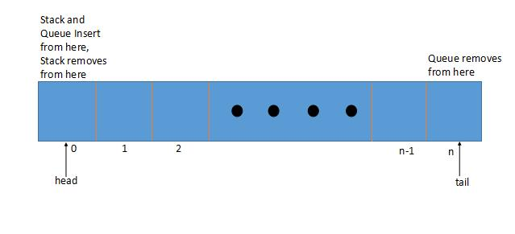
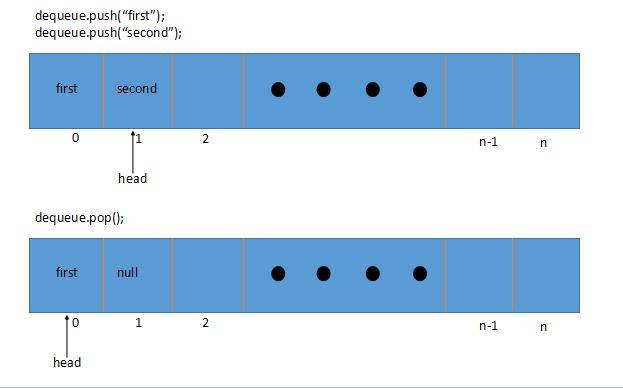
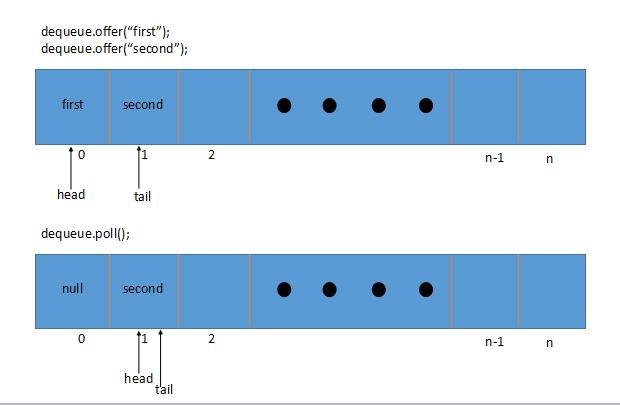

# Java ArrayDeque简介

## 1.概述
在本教程中，我们将展示如何使用Java的ArrayDeque类-这是Deque接口的实现。

ArrayDeque（也称为“ Array Double Ended Queue”，发音为“ ArrayDeck”）是一种特殊的可增长数组，允许我们从两侧添加或删除元素。


ArrayDeque实现可以用作堆栈（先进先出）或队列（先进先出）。

## 2. API概览
对于每个操作，我们基本上都有两个选择。

第一组由操作失败时引发异常的方法组成。 另一个组返回状态或值：

| Operation           | Method          | Method throwing Exception |
| ------------------- | --------------- | ------------------------- |
| Insertion from Head | *offerFirst(e)* | *addFirst(e)*             |
| Removal from Head   | *pollFirst()*   | *removeFirst()*           |
| Retrieval from Head | *peekFirst()*   | *getFirst()*              |
| Insertion from Tail | *offerLast(e)*  | *addLast(e)*              |
| Removal from Tail   | *pollLast()*    | *removeLast()*            |
| Retrieval from Tail | *peekLast()*    | *getLast()*               |

## 3.使用方法
让我们看一些如何使用ArrayDeque的简单示例。

### 3.1. 使用ArrayDeque作为堆栈
我们将从一个如何将类视为Stack的示例开始，然后推送一个元素：

```java
@Test
public void whenPush_addsAtFirst() {
    final Deque<String> deque = new ArrayDeque<>();

    deque.push("first");
    deque.push("second");

    assertEquals("second", deque.getFirst());
}
```

我们还看看如何将ArrayDeque中的元素用作堆栈：

```java
@Test
public void whenPop_removesLast() {
    final Deque<String> deque = new ArrayDeque<>();

    deque.push("first");
    deque.push("second");

    assertEquals("second", deque.pop());
}
```

当堆栈为空时，pop方法将引发NoSuchElementException。

```java
@Test
public void whenPop_NoSuchElementException() {
    final Deque<String> deque = new ArrayDeque<>();
    assertThrows(NoSuchElementException.class, () -> {
        deque.pop();
    });
}
```

### 3.2. 使用ArrayDeque作为队列
现在让我们从一个简单的示例开始，该示例演示如何在ArrayDeque中提供元素（用作简单Queue时）：

```java
@Test
public void whenOffer_addsAtLast() {
    final Deque<String> deque = new ArrayDeque<>();

    deque.offer("first");
    deque.offer("second");

    assertEquals("second", deque.getLast());
}
```

让我们看看如何从ArrayDeque中轮询元素，以及如何用作队列：

```java
@Test
public void whenPoll_removesFirst() {
    final Deque<String> deque = new ArrayDeque<>();

    deque.offer("first");
    deque.offer("second");

    assertEquals("first", deque.poll());
}
```

如果队列为空，则poll方法返回null值。

```java
@Test
public void whenPoll_isNull() {
    final Deque<String> deque = new ArrayDeque<>();
    assertNull(deque.poll());
}
```
## 4. ArrayDeque如何实现



在底层，ArrayDeque由数组支持，当数组被填充时，数组的大小加倍。

最初，数组以16的大小初始化。它被实现为双端队列，其中维护着两个指针，即头和尾。

让我们从高层次上观察这种逻辑的作用。

### 4.1.ArrayDeque作为堆栈




可以看出，当用户使用push方法添加元素时，它会将头指针移动一个。

当我们弹出一个元素时，它会将元素在头部的位置设置为null，以便可以对元素进行垃圾回收，然后将其向后移动一个指针。

### 4.2.ArrayDeque作为队列



当我们使用offer方法添加元素时，它会将尾部指针移动一个。

当用户轮询元素时，它会将元素在头部的位置设置为null，以便可以对元素进行垃圾回收，然后移动其头部指针。

### 4.3. 关于ArrayDeque的注意事项
最后，还有一些有关此特定实现值得理解和记住的注释：

它不是线程安全的
空元素不被接受
比同步堆栈快得多的工作速度
由于引用的位置更好，因此队列比LinkedList更快
大多数操作均摊销了恒定的时间复杂度
ArrayDeque返回的迭代器是快速失败的
当添加元素时头和尾指针相遇时，ArrayDeque自动将数组的大小加倍
## 5.结论
在这篇简短的文章中，我们说明了ArrayDeque中方法的用法。

