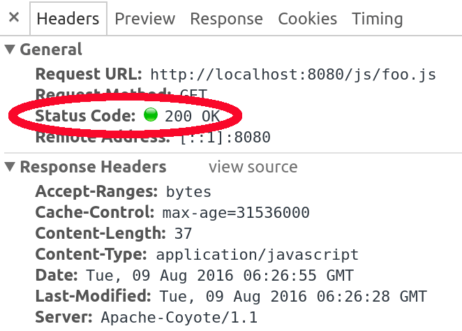
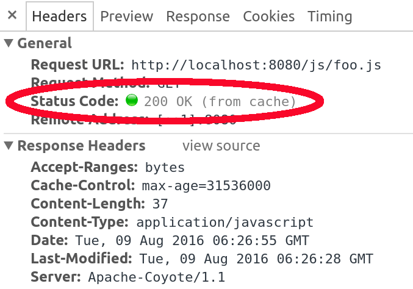

# 使用Spring MVC的可缓存静态资产

## 1.概述
本文重点介绍在通过Spring Boot和Spring MVC服务静态资产时（例如Javascript和CSS文件）缓存它们。

我们还将涉及“完美缓存”的概念，从本质上确保在更新文件时不会从缓存中错误地提供旧版本。

## 2.缓存静态资产
为了使静态资产可缓存，我们需要配置其相应的资源处理程序。

这是一个简单的示例，将响应上的Cache-Control标头设置为max-age = 31536000，这将导致浏览器使用文件的缓存版本一年：

```java
@EnableWebMvc
public class MvcConfig implements WebMvcConfigurer {
    @Override
    public void addResourceHandlers(ResourceHandlerRegistry registry) {
        registry.addResourceHandler("/js/**") 
                .addResourceLocations("/js/") 
                .setCacheControl(CacheControl.maxAge(365, TimeUnit.DAYS));
    }
}
```

我们具有如此长的缓存有效期的原因是，我们希望客户端使用文件的缓存版本，直到文件被更新为止，并且[根据RFC](https://www.ietf.org/rfc/rfc2616.txt)，我们可以为缓存控件使用的最长为365天标头。

因此，当客户端第一次请求foo.js时，他将通过网络接收整个文件（在这种情况下为37字节），其状态码为200 OK。该响应将具有以下标头来控制缓存行为：

`Cache-Control: max-age=31536000`
由于以下响应，这会指示浏览器缓存有效期为一年的文件：




当客户端第二次请求相同文件时，浏览器将不会再向服务器发出请求。相反，它将直接从其缓存中提供文件，并避免了网络往返，因此页面加载速度更快：



Chrome浏览器用户在测试时需要小心，因为如果您通过按屏幕上的刷新按钮或按F5键刷新页面，Chrome将不会使用缓存。您需要按地址栏上的Enter以观察缓存行为。有关此的更多信息。

### 2.1 Spring Boot
要在Spring Boot中自定义Cache-Control标头，我们可以使用[spring.resources.cache.cachecontrol](https://github.com/spring-projects/spring-boot/blob/master/spring-boot-project/spring-boot-autoconfigure/src/main/java/org/springframework/boot/autoconfigure/web/ResourceProperties.java#L285)属性名称空间下的属性。 例如，要将最大年龄更改为一年，我们可以在application.properties中添加以下内容：

`spring.resources.cache.cachecontrol.max-age=365d`
这适用于Spring Boot服务的所有静态资源。 因此，如果我们只想将缓存策略应用于请求的子集，则应使用普通的Spring MVC方法。

除了最大使用期限外，还可以使用类似的配置属性来自定义其他“[缓存控制](https://developer.mozilla.org/en-US/docs/Web/HTTP/Headers/Cache-Control)”参数，例如“无存储”或“无缓存”。

## 3.静态资产的版本控制
使用缓存来提供静态资产可以使页面加载真正快速，但是需要注意的是。当您更新文件时，客户端将不会获取文件的最新版本，因为它不会与服务器核对文件是否为最新文件，而只是从浏览器缓存中提供文件。

只有在文件更新时，我们才需要这样做，以使浏览器从服务器获取文件：

* 在包含版本的URL下提供文件。例如，foo.js应该放在/js/foo-46944c7e3a9bd20cc30fdc085cae46f2.js下
  使用新的URL更新到文件的链接
* 每当文件更新时，更新URL的版本部分。例如，更新foo.js后，现在应该将其放在/js/foo-a3d8d7780349a12d739799e9aa7d2623.js下。
* 客户端将在更新文件时向服务器请求文件，因为该页面将具有指向其他URL的链接，因此浏览器将不使用其缓存。如果文件未更新，其版本（因此其URL）将不会更改，客户端将继续使用该文件的缓存。

通常，我们需要手动完成所有这些操作，但是Spring开箱即用地支持这些操作，包括计算每个文件的哈希并将它们附加到URL上。让我们看看如何配置Spring应用程序来为我们完成所有这些工作。

### 3.1 服务于带有版本的URL
我们需要在路径中添加一个VersionResourceResolver，以便使用其URL中更新的版本字符串为该文件提供服务：

```java
@Override
public void addResourceHandlers(ResourceHandlerRegistry registry) {
    registry.addResourceHandler("/js/**")
            .addResourceLocations("/js/")
            .setCacheControl(CacheControl.maxAge(365, TimeUnit.DAYS))
            .resourceChain(false)
            .addResolver(new VersionResourceResolver().addContentVersionStrategy("/**"));
}
```

在这里，我们使用内容版本策略。 / js文件夹中的每个文件都将在URL下提供，该URL具有根据其内容计算出的版本。这称为指纹识别。例如，现在将在URL `/js/foo-46944c7e3a9bd20cc30fdc085cae46f2.js`下提供foo.js。

使用此配置，当客户端请求`http://localhost:8080/js/foo-46944c7e3a9bd20cc30fdc085cae46f2.js`时：

`curl -i http://localhost:8080/js/foo-46944c7e3a9bd20cc30fdc085cae46f2.js`
服务器将以Cache-Control标头响应，以告知客户端浏览器将文件缓存一年：

```
HTTP/1.1 200 OK
Server: Apache-Coyote/1.1
Last-Modified: Tue, 09 Aug 2016 06:43:26 GMT
Cache-Control: max-age=31536000
```

### 3.2 Spring Boot
为了在Spring Boot中启用相同的基于内容的版本控制，我们只需要在spring.resources.chain.strategy.content属性名称空间下使用一些配置。 例如，通过添加以下配置，我们可以获得与以前相同的结果：

```properties
spring.resources.chain.strategy.content.enabled=true
spring.resources.chain.strategy.content.paths=/**
```

与Java配置类似，这将为与/ **路径模式匹配的所有资产启用基于内容的版本控制。

### 3.3 使用新URL更新链接
在将版本插入URL之前，我们可以使用一个简单的脚本标记来导入foo.js：

`<script type="text/javascript" src="/js/foo.js">`

现在，我们在具有版本的URL下提供相同的文件，我们需要在页面上反映出来：

`<script type="text/javascript"
  src="<em>/js/foo-46944c7e3a9bd20cc30fdc085cae46f2.js</em>">`

处理所有这些漫长的道路变得乏味。 Spring为这个问题提供了一个更好的解决方案。我们可以使用ResourceUrlEncodingFilter和JSTL的url标记来重写带有版本号的链接的URL。

可以照常在web.xml下注册ResourceURLEncodingFilter：

```xml
<filter>
    <filter-name>resourceUrlEncodingFilter</filter-name>
    <filter-class>
        org.springframework.web.servlet.resource.ResourceUrlEncodingFilter
    </filter-class>
</filter>
<filter-mapping>
    <filter-name>resourceUrlEncodingFilter</filter-name>
    <url-pattern>/*</url-pattern>
</filter-mapping>
```

必须先在我们的JSP页面上导入JSTL核心标记库，然后才能使用url标记：

`<%@ taglib uri="http://java.sun.com/jsp/jstl/core" prefix="c" %>`
然后，我们可以使用url标记来导入foo.js，如下所示：

`<script type="text/javascript" src="<c:url value="/js/foo.js" />">`
呈现此JSP页面时，将正确重写文件的URL，以在其中包含版本：

`<script type="text/javascript" src="/js/foo-46944c7e3a9bd20cc30fdc085cae46f2.js">`

### 3.4 URL的更新版本部分
每当文件更新时，都会重新计算其版本，并在包含新版本的URL下提供文件。 我们不需要为此做任何其他工作，VersionResourceResolver会为我们处理。

## 4.修复CSS链接
CSS文件可以使用@import指令导入其他CSS文件。例如，myCss.css文件导入another.css文件：

`@import "another.css";`
这通常会导致版本化静态资产出现问题，因为浏览器将请求另一个.css文件，但是该文件在版本化路径下提供，例如另一个-9556ab93ae179f87b178cfad96a6ab72.css。

为了解决此问题并向正确的路径发出请求，我们需要将CssLinkResourceTransformer引入资源处理程序配置：

```java
@Override
public void addResourceHandlers(ResourceHandlerRegistry registry) {
    registry.addResourceHandler("/resources/**")
            .addResourceLocations("/resources/", "classpath:/other-resources/")
            .setCacheControl(CacheControl.maxAge(365, TimeUnit.DAYS))
            .resourceChain(false)
            .addResolver(new VersionResourceResolver().addContentVersionStrategy("/**"))
            .addTransformer(new CssLinkResourceTransformer());
}
```

这将修改myCss.css的内容，并将import语句替换为以下内容：

`@import "another-9556ab93ae179f87b178cfad96a6ab72.css";`
## 5.结论
利用HTTP缓存可以极大地提高网站性能，但是避免在使用缓存时提供陈旧的资源可能很麻烦。

在本文中，我们实现了一个很好的策略，即在使用Spring MVC服务静态资产时使用HTTP缓存，并在文件更新时清除缓存。