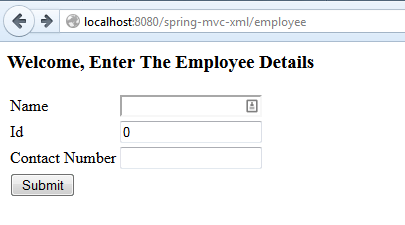
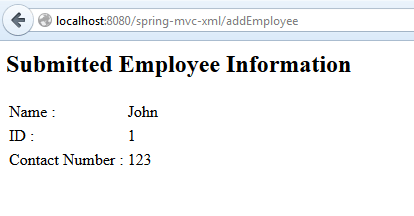

# Spring MVC中的表单入门

## 1.概述
在本文中，我们将讨论Spring表单和与控制器的数据绑定。 另外，我们将看看Spring MVC中的主要注释之一，即@ModelAttribute。

当然，Spring MVC是一个复杂的主题，要充分利用它，您需要了解很多事情，因此，在这里一定要更深入地研究框架。

## 2.模型
首先–让我们定义一个简单的实体，该实体将显示并绑定到表单：

```java
@Data
@NoArgsConstructor
@AllArgsConstructor
public class Employee {
    private long id;
    private String name;
    private String contactNumber;
}
```

这将是我们的表单支持对象。

## 3.视图
下一步–让我们定义实际的表单，当然还有定义它的HTML文件。 我们将使用一个页面来创建/注册新员工：

```html
<%@ taglib prefix="form" uri="http://www.springframework.org/tags/form"%>
<html>
    <head>
    </head>
    <body>
        <h3>Welcome, Enter The Employee Details</h3>
        <form:form method="POST"
          action="/spring-mvc-xml/addEmployee" modelAttribute="employee">
             <table>
                <tr>
                    <td><form:label path="name">Name</form:label></td>
                    <td><form:input path="name"/></td>
                </tr>
                <tr>
                    <td><form:label path="id">Id</form:label></td>
                    <td><form:input path="id"/></td>
                </tr>
                <tr>
                    <td><form:label path="contactNumber">
                      Contact Number</form:label></td>
                    <td><form:input path="contactNumber"/></td>
                </tr>
                <tr>
                    <td><input type="submit" value="Submit"/></td>
                </tr>
            </table>
        </form:form>
    </body>
</html>
```

首先，请注意，我们在JSP页面中包含了一个标记库，即taglib表单，以帮助定义表单。

下一步– <form：form>标记在这里起着重要的作用； 它与常规HTLM <form>标签非常相似，但是modelAttribute属性是用于指定支持此表单的模型对象名称的键：

```jps
<form:form method="POST"
  action="/SpringMVCFormExample/addEmployee" modelAttribute="employee">
```

稍后将在控制器中与@ModelAttribute对应。

接下来–每个输入字段都使用Spring Form taglib中的另一个有用标签– form：前缀。 这些字段中的每个字段都指定一个路径属性–该属性必须对应于模型属性的获取器/设置器（在本例中为Employee类）。 加载页面时，Spring将填充输入字段，Spring会调用绑定到输入字段的每个字段的getter。 提交表单后，将调用设置器，以将表单的值保存到对象。

最后-提交表单后，将调用控制器中的POST处理程序，并将表单自动绑定到我们传入的employee参数。

## 4.控制器
现在，让我们看一下将要处理后端的Controller：

```java
@Controller
public class EmployeeController {
 
    @RequestMapping(value = "/employee", method = RequestMethod.GET)
    public ModelAndView showForm() {
        return new ModelAndView("employeeHome", "employee", new Employee());
    }
 
    @RequestMapping(value = "/addEmployee", method = RequestMethod.POST)
    public String submit(@Valid @ModelAttribute("employee")Employee employee, 
      BindingResult result, ModelMap model) {
        if (result.hasErrors()) {
            return "error";
        }
        model.addAttribute("name", employee.getName());
        model.addAttribute("contactNumber", employee.getContactNumber());
        model.addAttribute("id", employee.getId());
        return "employeeView";
    }
}
```

控制器定义了两个简单的操作-通过表单的提交，用于在表单中显示数据的GET和用于创建操作的POST。

还要注意，如果未将名为“ employee”的对象添加到模型中，则当我们尝试访问JSP时，Spring会抱怨，因为将设置JSP将表单绑定到“ employee”模型属性：

```console
java.lang.IllegalStateException: 
  Neither BindingResult nor plain target object 
    for bean name 'employee' available as request attribute
  at o.s.w.s.s.BindStatus.<init>(BindStatus.java:141)
```


要访问表单支持对象，我们需要通过@ModelAttribute批注注入它。

方法参数上的@ModelAttribute表示将从模型中检索参数。 如果模型中不存在该参数，则将首先实例化该参数，然后将其添加到模型中。

## 5.处理绑定错误
默认情况下，当请求绑定期间发生错误时，Spring MVC会引发异常。通常这不是我们想要的，相反，我们应该向用户显示这些错误。我们将通过在控制器方法中添加一个作为参数来使用BindingResult：

```java
public String submit(
  @Valid @ModelAttribute("employee") Employee employee,
  BindingResult result,
  ModelMap model)
```

BindingResult参数需要放在表单支持对象之后，这是方法参数顺序很重要的罕见情况之一。否则，我们将遇到以下异常：

```
java.lang.IllegalStateException: 
  Errors/BindingResult argument declared without preceding model attribute. 
    Check your handler method signature!
```

现在–不再抛出异常；相反，错误将在传递给Submit方法的BindingResult上注册。此时，我们可以通过多种方式处理这些错误-例如，可以取消操作：

```java
@RequestMapping(value = "/addEmployee", method = RequestMethod.POST)
public String submit(@Valid @ModelAttribute("employee")Employee employee, 
  BindingResult result,  ModelMap model) {
    if (result.hasErrors()) {
        return "error";
    }
     
    //Do Something
    return "employeeView";
}
```

请注意，如果结果包含错误，我们如何将另一个视图返回给用户，以便正确显示这些错误。让我们看一下该视图– error.jsp：

```jsp
<html>
    <head>
    </head>
 
    <body>
        <h3>Please enter the correct details</h3>
        <table>
            <tr>
                <td><a href="employee">Retry</a></td>
            </tr>
        </table>
    </body>
 
</html>
```

## 6.展示员工
最后，除了创建新员工之外，我们还可以简单地显示一个员工-这是该员工的快速查看代码：

```jsp
<body>
    <h2>Submitted Employee Information</h2>
    <table>
        <tr>
            <td>Name :</td>
            <td>${name}</td>
        </tr>
        <tr>
            <td>ID :</td>
            <td>${id}</td>
        </tr>
        <tr>
            <td>Contact Number :</td>
            <td>${contactNumber}</td>
        </tr>
    </table>
</body>
```

JSP页面只是使用EL表达式来显示模型中Employee对象的属性值。

## 7.测试应用程序
该简单应用程序可以部署在例如Tomcat服务器中，并可以在本地访问：

http：// localhost：8080 / spring-mvc-xml / employee

这是包含主要表单的视图-提交操作之前：



Spring MVC表单示例–提交

提交后，将显示数据：



Spring MVC表单示例–视图

就是这样–一个带有验证的Spring MVC的简单表单的工作示例。

