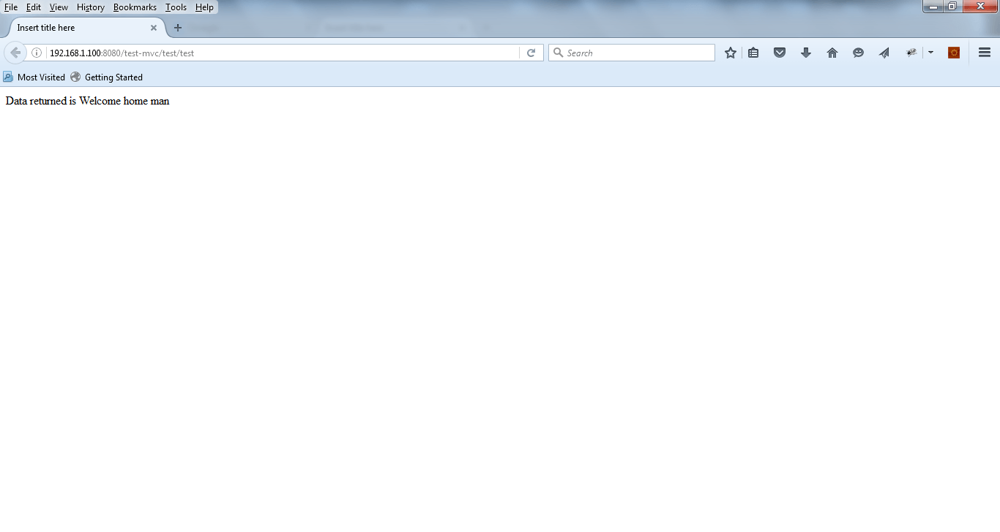
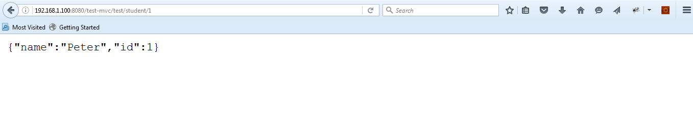

# Spring Controller快速指南

## 1.简介
在本文中，我们将重点介绍Spring MVC中的核心概念-控制器。

## 2.概述
让我们先退后一步，看看典型的Spring Model View Controller体系结构中Front Controller的概念。

在很高的层次上，这是我们要关注的主要职责：

拦截传入的请求
将请求的有效负载转换为数据的内部结构
将数据发送到模型进行进一步处理
从模型获取处理后的数据，并将其前进到视图以进行渲染
这是Spring MVC中高级流程的快速示意图：


如您所见，DispatcherServlet在体系结构中扮演了前端控制器的角色。

该图适用于典型的MVC控制器以及RESTful控制器-两者之间存在一些细微差别（如下所述）。

在传统方法中，MVC应用程序不面向服务，因此有一个View Resolver可以根据从Controller接收到的数据渲染最终视图。

RESTful应用程序旨在面向服务并返回原始数据（通常为JSON / XML）。 由于这些应用程序不执行任何视图渲染，因此没有视图解析器–通常希望控制器直接通过HTTP响应发送数据。

让我们从MVC0样式的控制器开始。

## 3. Maven依赖
为了能够使用Spring MVC，让我们首先处理Maven依赖项：

```xml
<dependency>
    <groupId>org.springframework</groupId>
    <artifactId>spring-webmvc</artifactId>
    <version>5.0.6.RELEASE</version>
<dependency>
```

要获取该库的最新版本，请在Maven Central上查看[spring-webmvc](https://mvnrepository.com/artifact/org.springframework/spring-webmvc)。

## 4.项目Web配置
现在，在查看控制器本身之前，我们首先需要建立一个简单的Web项目并进行快速的Servlet配置。

首先让我们看看如何在不使用web.xml的情况下（而不是使用初始化程序）设置DispatcherServlet：

```java
public class StudentControllerConfig implements WebApplicationInitializer {
 
    @Override
    public void onStartup(ServletContext sc) throws ServletException {
        AnnotationConfigWebApplicationContext root = 
          new AnnotationConfigWebApplicationContext();
        root.register(WebConfig.class);
 
        root.refresh();
        root.setServletContext(sc);
 
        sc.addListener(new ContextLoaderListener(root));
 
        DispatcherServlet dv = 
          new DispatcherServlet(new GenericWebApplicationContext());
 
        ServletRegistration.Dynamic appServlet = sc.addServlet("test-mvc", dv);
        appServlet.setLoadOnStartup(1);
        appServlet.addMapping("/test/*");
    }
}
```

要设置没有XML的内容，请确保在类路径上具有servlet-api 3.1.0。

这是web.xml的样子：

```xml
<servlet>
    <servlet-name>test-mvc</servlet-name>
    <servlet-class>
      org.springframework.web.servlet.DispatcherServlet
    </servlet-class>
    <load-on-startup>1</load-on-startup>
    <init-param>
        <param-name>contextConfigLocation</param-name>
        <param-value>/WEB-INF/test-mvc.xml</param-value>
    </init-param>
</servlet>
```

我们在这里设置contextConfigLocation属性–指向用于加载Spring上下文的XML文件。 如果该属性不存在，Spring将搜索名为{servlet_name} -servlet.xml的文件。

在我们的例子中，servlet_name是test-mvc，因此，在此示例中，DispatcherServlet将搜索名为test-mvc-servlet.xml的文件。

最后，让我们设置DispatcherServlet并将其映射到特定的URL –在这里完成基于Front Controller的系统：

```xml
<servlet-mapping>
    <servlet-name>test-mvc</servlet-name>
    <url-pattern>/test/*</url-pattern>
</servlet-mapping>
```

因此，在这种情况下，DispatcherServlet将拦截模式/ test / *中的所有请求。

## 5. Spring MVC Web配置
现在让我们看一下如何使用Spring Config来设置Dispatcher Servlet：

```java
@Configuration
@EnableWebMvc
@ComponentScan(basePackages = {"com.tom.controller.controller", "com.tom.controller", "com.tom.controller.config"})
public class WebConfig implements WebMvcConfigurer {
    @Override
    public void configureDefaultServletHandling(DefaultServletHandlerConfigurer configurer) {
        configurer.enable();
    }

    @Bean
    public ViewResolver viewResolver() {
        InternalResourceViewResolver bean = new InternalResourceViewResolver();
        bean.setPrefix("/WEB-INF/");
        bean.setSuffix(".jsp");
        return bean;
    }
}
```
现在让我们看一下使用XML设置Dispatcher Servlet的方法。 DispatcherServlet XML文件的快照– DispatcherServlet用于加载自定义控制器和其他Spring实体的XML文件如下所示：

```xml
<context:component-scan base-package="com.tom.controller" />
<mvc:annotation-driven />
<bean class="org.springframework.web.servlet.view.InternalResourceViewResolver">
    <property name="prefix">
        <value>/WEB-INF/</value>
    </property>
    <property name="suffix">
        <value>.jsp</value>
    </property>
</bean>
```
基于此简单配置，该框架当然将初始化它将在类路径中找到的所有控制器bean。
请注意，我们还定义了负责视图渲染的View Resolver –我们将在这里使用Spring的InternalResourceViewResolver。 此期望解决的视图的名称，该装置通过使用前缀和后缀（在XML配置既定义）找到一个对应的页面。
因此，例如，如果控制器返回一个名为“ welcome”的视图，则视图解析器将尝试解析WEB-INF文件夹中名为“ welcome.jsp”的页面。
## 6. MVC控制器
现在，让我们最后实现MVC样式控制器。

注意我们如何返回一个ModelAndView对象-它包含一个model map和一个view对象； 两者都将由View Resolver用于数据渲染：

```JAVA
@Controller
@RequestMapping(value = "/test")
public class TestController {
 
    @GetMapping
    public ModelAndView getTestData() {
        ModelAndView mv = new ModelAndView();
        mv.setViewName("welcome");
        mv.getModel().put("data", "Welcome home man");
 
        return mv;
    }
}
```

因此，我们在这里究竟设置了什么。


首先，我们创建了一个名为TestController的控制器，并将其映射到“ / test”路径。 在该类中，我们创建了一个返回ModelAndView对象并映射到GET请求的方法，因此，任何以“ test”结尾的URL调用都将由DispatcherServlet路由到TestController中的getTestData方法。

当然，我们将返回带有一些模型数据的ModelAndView对象以取得良好的效果。

视图对象的名称设置为“ welcome”。 如上所述，View Resolver将在WEB-INF文件夹中搜索名为“ welcome.jsp”的页面。

您可以在下面看到示例GET操作的结果：



请注意，URL以“ test”结尾。 URL的模式是“ / test / test”。

第一个“ / test”来自Servlet，第二个“ / test”来自控制器的映射。

## 7. REST的更多Spring依赖关系
现在让我们开始看看RESTful控制器。 当然，一个好的开始是我们需要的额外的Maven依赖项：

```JAVA
<dependencies>
    <dependency>
        <groupId>org.springframework</groupId>
        <artifactId>spring-webmvc</artifactId>
        <version>5.0.6.RELEASE</version>
    </dependency>
    <dependency>
        <groupId>org.springframework</groupId>
        <artifactId>spring-web</artifactId>
        <version>5.0.6.RELEASE</version>
    </dependency>
    <dependency>
        <groupId>com.fasterxml.jackson.core</groupId>
        <artifactId>jackson-databind</artifactId>
        <version>2.9.5</version>
    </dependency>
</dependencies>
```

请参阅[jackson-core](https://mvnrepository.com/artifact/com.fasterxml.jackson.core/jackson-core)，[spring-webmvc](https://mvnrepository.com/artifact/org.springframework/spring-webmvc)和[spring-web](https://mvnrepository.com/artifact/org.springframework/spring-web)链接以获取这些依赖项的最新版本。

Jackson当然不是强制性的，但肯定是启用JSON支持的好方法。 如果您想深入了解该支持，请查看此处的消息转换器文章。

## 8. REST控制器
Spring RESTful应用程序的设置与MVC应用程序的设置相同，唯一的区别是没有View解析器和模型映射。

API通常会简单地将原始数据返回给客户端（通常是XML和JSON表示形式），因此DispatcherServlet绕过了视图解析器，并直接在HTTP响应主体中返回了数据。

让我们看一个简单的RESTful控制器实现：

```JAVA
@Controller
public class RestController {

    @GetMapping(value = "/student/{studentId}")
    public @ResponseBody
    Student getTestData(@PathVariable Integer studentId) {
        Student student = new Student();
        student.setName("Peter");
        student.setId(studentId);

        return student;

    }
}
```

注意方法上的@ResponseBody批注-指示Spring绕过视图解析器，实际上将输出直接写到HTTP响应的正文中。

输出的快速快照如下所示：

上面的输出是将GET请求发送到学生ID为1的API的结果。

这里的一个简短说明是– @RequestMapping批注是您为了真正发挥其全部潜力而必须探索的主要批注之一。

## 9. Spring Boot和@RestController注释
Spring Boot的@RestController注释基本上是一个快速的快捷方式，使我们不必总是定义@ResponseBody。

这是使用此新注释的上一个示例控制器：

```JAVA
@RestController
public class RestAnnotatedController {
    @GetMapping(value = "/annotated/student/{studentId}")
    public Student getData(@PathVariable Integer studentId) {
        Student student = new Student();
        student.setName("Peter");
        student.setId(studentId);
 
        return student;
    }
}
```

## 10.结论
在本指南中，我们从典型的MVC应用程序以及RESTful API的角度探讨了在Spring中使用控制器的基础。

