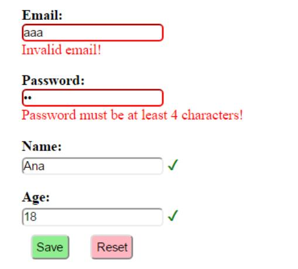

# 使用AngularJS和Spring MVC进行表单验证

## 1.概述
验证从未像我们期望的那么简单。 当然，验证用户输入到应用程序中的值对于保持我们数据的完整性非常重要。

在Web应用程序的上下文中，数据输入通常使用HTML表单完成，并且需要客户端和服务器端验证。

在本教程中，我们将看一下使用AngularJS实现表单输入的客户端验证以及使用Spring MVC框架实现服务器端验证。

## 2. Maven依赖
首先，让我们添加以下依赖项：

```xml
<dependency>
    <groupId>org.springframework</groupId>
    <artifactId>spring-webmvc</artifactId>
    <version>4.3.7.RELEASE</version>
</dependency>
<dependency>
    <groupId>org.hibernate</groupId>
    <artifactId>hibernate-validator</artifactId>
    <version>5.4.0.Final</version>
</dependency>
<dependency>
    <groupId>com.fasterxml.jackson.core</groupId>
    <artifactId>jackson-databind</artifactId>
    <version>2.8.7</version>
</dependency>
```

可以从Maven Central下载[spring-webmvc](https://search.maven.org/classic/#search%7Cga%7C1%7Ca%3A%22spring-webmvc%22)，[hibernate-validator](https://search.maven.org/classic/#search%7Cga%7C1%7Ca%3A%22hibernate-validator%22)和[jackson-databind](https://search.maven.org/classic/#search%7Cga%7C1%7Ca%3A%22jackson-databind%22)的最新版本。

## 3.使用Spring MVC进行验证
应用程序绝对不应仅依靠客户端验证，因为这很容易被规避。 为了防止保存不正确或恶意的值或导致应用程序逻辑的不正确执行，同样重要的是在服务器端验证输入值。

Spring MVC通过使用JSR 349 Bean验证规范注释提供对服务器端验证的支持。 对于此示例，我们将使用规范的参考实现，即hibernate-validator。

### 3.1 数据模型
让我们创建一个User类，该类具有用适当的验证注释注释的属性：

```java
@Data
@NoArgsConstructor
@AllArgsConstructor
public class User {

    @NotNull
    @Email
    private String email;

    @NotNull
    @Size(min = 4, max = 15)
    private String password;

    @NotBlank
    private String name;

    @Min(18)
    @Digits(integer = 2, fraction = 0)
    private int age;
}
```

上面使用的注释属于JSR 349规范，@ Email和@NotBlank除外，它们专用于hibernate-validator库。

### 3.2 Spring MVC控制器
让我们创建一个定义/ user终结点的控制器类，该类将用于将新的User对象保存到List。

为了启用对通过请求参数接收到的User对象的验证，必须在声明之前加上@Valid批注，并将验证错误保存在BindingResult实例中。

要确定对象是否包含无效值，可以使用BindingResult的hasErrors（）方法。

如果hasErrors（）返回true，我们可以返回一个JSON数组，其中包含与未通过验证相关的错误消息。 否则，我们将对象添加到列表中：

```java
@PostMapping("/user")
@ResponseBody
public ResponseEntity<Object> saveUser(@Valid User user, BindingResult result, Model model) {
    if (result.hasErrors()) {
        final List<String> errors = result.getAllErrors().stream()
          .map(DefaultMessageSourceResolvable::getDefaultMessage)
          .collect(Collectors.toList());

        return new ResponseEntity<>(errors, HttpStatus.OK);
    } else {
        if (users.stream().anyMatch(it -> user.getEmail().equals(it.getEmail()))) {
            return new ResponseEntity<>(Collections.singletonList("Email already exists!"), HttpStatus.CONFLICT);
        } else {
            users.add(user);
            return new ResponseEntity<>(HttpStatus.CREATED);
        }
    }
}
```

如您所见，服务器端验证增加了能够执行客户端无法执行的其他检查的优势。

在我们的案例中，我们可以验证是否存在使用相同电子邮件的用户-如果是这种情况，则返回状态409 CONFLICT。

我们还需要定义用户列表，并使用一些值对其进行初始化：

```java
private List<User> users = Arrays.asList(
  new User("ana@yahoo.com", "pass", "Ana", 20),
  new User("bob@yahoo.com", "pass", "Bob", 30),
  new User("john@yahoo.com", "pass", "John", 40),
  new User("mary@yahoo.com", "pass", "Mary", 30));
```

我们还添加一个映射，以将用户列表作为JSON对象检索：

```java
@GetMapping("/users")
@ResponseBody
public List<User> getUsers() {
    return users;
}
```

我们的Spring MVC控制器中需要的最后一项是返回我们应用程序主页的映射：

```java
@GetMapping("/userPage")
public String getUserProfilePage() {
    return "user";
}
```

我们将在AngularJS部分中更详细地查看user.html页面。

### 3.3 Spring MVC配置
让我们向应用程序中添加一个基本的MVC配置：

```java
@Configuration
@EnableWebMvc
@ComponentScan(basePackages = "com.tom.springmvcforms")
class ApplicationConfiguration implements WebMvcConfigurer {
 
    @Override
    public void configureDefaultServletHandling(
      DefaultServletHandlerConfigurer configurer) {
        configurer.enable();
    }
 
    @Bean
    public InternalResourceViewResolver htmlViewResolver() {
        InternalResourceViewResolver bean = new InternalResourceViewResolver();
        bean.setPrefix("/WEB-INF/html/");
        bean.setSuffix(".html");
        return bean;
    }
}
```

### 3.4 初始化应用程序
让我们创建一个实现WebApplicationInitializer接口的类以运行我们的应用程序：

 ```java
public class WebInitializer implements WebApplicationInitializer {
 
    public void onStartup(ServletContext container) throws ServletException {
 
        AnnotationConfigWebApplicationContext ctx
          = new AnnotationConfigWebApplicationContext();
        ctx.register(ApplicationConfiguration.class);
        ctx.setServletContext(container);
        container.addListener(new ContextLoaderListener(ctx));
 
        ServletRegistration.Dynamic servlet 
          = container.addServlet("dispatcher", new DispatcherServlet(ctx));
        servlet.setLoadOnStartup(1);
        servlet.addMapping("/");
    }
}
 ```

### 3.5 使用Curl测试Spring Mvc验证
在实现AngularJS客户端部分之前，我们可以使用cURL通过以下命令测试API：

`curl -i -X POST -H "Accept:application/json" "localhost:8082/spring-mvc-forms/user?email=aaa&password=12&age=12"`

响应是一个包含默认错误消息的数组：

```
["个数必须在4和15之间","不是一个合法的电子邮件地址","最小不能小于18","不能为空"]
```

## 4. AngularJS验证
客户端验证可用于创建更好的用户体验，因为它为用户提供了有关如何成功提交有效数据的信息，并使他们能够继续与应用程序进行交互。

AngularJS库为在表单字段上添加验证要求，处理错误消息以及设计有效和无效表单的样式提供了强大的支持。

首先，让我们创建一个AngularJS模块，该模块注入ngMessages模块，该模块用于验证消息：
```js
var app = angular.module('app', ['ngMessages']);
```

接下来，让我们创建一个AngularJS服务和控制器，它将使用上一节中构建的API。

### 4.1 AngularJS服务
我们的服务将提供两种调用MVC控制器方法的方法-一种用于保存用户，另一种用于检索用户列表：

```js
app.service('UserService',['$http', function ($http) {
   
    this.saveUser = function saveUser(user){
        return $http({
          method: 'POST',
          url: 'user',
          params: {email:user.email, password:user.password, name:user.name, age:user.age},
          headers: 'Accept:application/json'
        });
    }
   
   
    this.getUsers = function getUsers(){
        return $http({
          method: 'GET',
          url: 'users',
          headers:'Accept:application/json'
        }).then( function(response){
           return response.data;
        } );
    }

}]);
```

### 4.2 AngularJS控制器
UserCtrl控制器注入UserService，调用服务方法并处理响应和错误消息：

```js
app.controller('UserCtrl', ['$scope','UserService', function ($scope,UserService) {
   
   $scope.submitted = false;
   
   $scope.getUsers = function() {
         UserService.getUsers().then( function(data){
             $scope.users = data;
          });
      }
    
    $scope.saveUser = function () {
       $scope.submitted = true;
         if ($scope.userForm.$valid){
            UserService.saveUser($scope.user)
              .then (function success(response){
                  $scope.message = 'User added!';
                  $scope.errorMessage = '';
                  $scope.getUsers();
                  $scope.user = null;
                  $scope.submitted = false;
              },
              function error(response){
                 if (response.status == 409){
                  $scope.errorMessage = response.data[0];
                 }
                 else {
                    $scope.errorMessage = 'Error adding user!';
                 }
                  $scope.message = '';
            });
         }
    }
   
   $scope.getUsers();
   
   $scope.resetForm = function () {
      $scope.userForm.$setPristine();
      $scope.user=null;
      $scope.message='';
      $scope.errorMessage='';
      $scope.submitted = false;
   }
    
}]);
```

我们可以在上面的示例中看到，仅当userForm的$ valid属性为true时，才调用service方法。 尽管如此，在这种情况下，仍然需要检查重复的电子邮件，这只能在服务器上完成，并在error（）函数中单独进行处理。

另外，请注意，已定义了一个已提交的变量，它将告诉我们表单是否已提交。

最初，此变量为false，并且在调用saveUser（）方法时，它变为true。 如果我们不希望在用户提交表单之前显示验证消息，则可以使用提交的变量来防止这种情况。

### 4.3 使用AngularJS验证的表单
为了使用AngularJS库和我们的AngularJS模块，我们需要将脚本添加到我们的user.html页面中：

```js
<script src="https://ajax.googleapis.com/ajax/libs/angularjs/1.5.6/angular.min.js"></script>
<script src="https://ajax.googleapis.com/ajax/libs/angularjs/1.4.0/angular-messages.js"></script>

<script src="js/app.js"></script>
```

然后，我们可以通过设置ng-app和ng-controller属性来使用我们的模块和控制器：

```html
<body ng-app="app" ng-controller="UserCtrl">
```

让我们创建HTML表单：

```html
<form name="userForm" method="POST" novalidate 
  ng-class="{'form-error':submitted}" ng-submit="saveUser()" >
...
</form>
```

请注意，我们必须在表单上设置novalidate属性，以防止默认的HTML5验证并将其替换为我们自己的验证。

如果所提交的变量的值为true，则ng-class属性将动态添加表单错误的CSS类到表单中。

ng-submit属性定义了AngularJS控制器函数，在提交表单时将调用该函数。 使用ng-submit而不是ng-click的优点是，它也响应使用ENTER键提交表单。

现在，为用户属性添加四个输入字段：

```html
<label class="form-label">Email:</label>
<input type="email" name="email" required ng-model="user.email" class="form-input"/>
 
<label class="form-label">Password:</label>
<input type="password" name="password" required ng-model="user.password"
  ng-minlength="4" ng-maxlength="15" class="form-input"/>
 
<label class="form-label">Name:</label>
<input type="text" name="name" ng-model="user.name" ng-trim="true"
  required class="form-input" />
 
<label class="form-label">Age:</label>
<input type="number" name="age" ng-model="user.age" ng-min="18"
  class="form-input" required/>
```

每个输入字段都通过ng-model属性绑定到用户变量的属性。

为了设置验证规则，我们使用HTML5必需属性和几个特定于AngularJS的属性：ng-minglength，ng-maxlength，ng-min和ng-trim。

对于电子邮件字段，我们还将type属性和电子邮件值一起用于客户端电子邮件验证。

为了添加与每个字段相对应的错误消息，AngularJS提供了ng-messages指令，该指令循环遍历输入的$ errors对象，并根据每个验证规则显示消息。

让我们在输入定义之后添加email字段的指令：
```html
<div ng-messages="userForm.email.$error"
  ng-show="submitted && userForm.email.$invalid" class="error-messages">
    <p ng-message="email">Invalid email!</p>
    <p ng-message="required">Email is required!</p>
</div>
```

可以为其他输入字段添加类似的错误消息。

我们可以使用带有布尔表达式的ng-show属性来控制何时在电子邮件字段中显示指令。在我们的示例中，当字段具有无效值时显示指令，这意味着$ invalid属性为true，而提交的变量也为true。

一次只显示一个错误消息。

如果字段有效，我们也可以在输入字段后添加一个复选标记（用十六进制字符✓表示），具体取决于$ valid属性：

`<div class="check" ng-show="userForm.email.$valid">✓</div>`
AngularJS验证还提供了使用CSS类（例如ng-valid和ng-invalid）或更具体的类（例如ng-invalid-required和ng-invalid-minlength）进行样式支持。

让我们为表单的form-error类内的无效输入添加CSS属性border-color：red：
```css
.form-error input.ng-invalid {
    border-color:red;
}
```
我们还可以使用CSS类以红色显示错误消息：

```css
.error-messages {
    color:red;
}
```


将所有内容放在一起后，让我们看一个示例，其中显示了将有效值和无效值混合填写后的客户端表单验证的外观：



## 5.结论
在本教程中，我们展示了如何使用AngularJS和Spring MVC结合客户端验证和服务器端验证。

要查看该应用程序，请在运行后访问/ userPage URL。

## 6. Issuers

* [使用Redirector插件解决googleapis公共库加载的问题](https://www.cnblogs.com/jackadam/p/11258463.html)

  这个规则只匹配了ajax.googleapis.com 替换

  **中国科技技术大学** 搭设的googleapis镜像站，能够完美的支持 HTTPS 协议：

  * fonts.googleapis.com 替换成 fonts.lug.ustc.edu.cn
  * ajax.googleapis.com 替换成 ajax.lug.ustc.edu.cn
  * themes.googleusercontent.com 替换成 google-themes.lug.ustc.edu.cn
  * fonts.gstatic.com 替换成 fonts-gstatic.lug.ustc.edu.cn