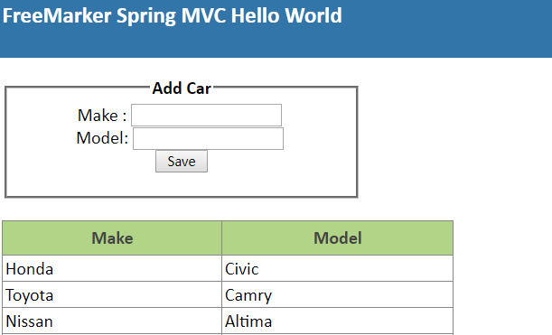

# 在Spring MVC中使用FreeMarker的简介

## 1.概述
FreeMarker是来自Apache Software Foundation的基于Java的模板引擎。 与其他模板引擎一样，FreeMarker旨在支持遵循MVC模式的应用程序中的HTML网页。 本教程说明了如何配置FreeMarker以在Spring MVC中使用，以替代JSP。

本文不会讨论Spring MVC使用的基础知识。 要对此进行深入了解，请参阅本文。 另外，这并不是要详细了解FreeMarker的广泛功能。 有关FreeMarker用法和语法的更多信息，请访问其[网站](https://freemarker.incubator.apache.org/)。

## 2. Maven依赖
由于这是一个基于Maven的项目，因此我们首先将所需的依赖项添加到pom.xml中：

```xml
<dependency>
    <groupId>org.freemarker</groupId>
    <artifactId>freemarker</artifactId>
    <version>2.3.23</version>
</dependency>
<dependency>
    <groupId>org.springframework</groupId>
    <artifactId>spring-context-support</artifactId>
    <version>${spring.version}</version>
</dependency>
```

## 3.配置
现在，让我们深入进行项目配置。 这是一个基于注释的Spring项目，因此我们将不演示基于XML的配置。

### 3.1 Spring Web配置
让我们创建一个类来配置Web组件。 为此，我们需要使用@ EnableWebMvc，@ Configuration和@ComponentScan注释类。

```java
@EnableWebMvc
@Configuration
@ComponentScan({ "com.tom.freemarker" })
public class SpringWebConfig implements WebMvcConfigurer {

    @Override
    public void addResourceHandlers(ResourceHandlerRegistry registry) {
        registry.addResourceHandler("/resources/**").addResourceLocations("/resources/");
    }
}
```

### 3.2 配置ViewResolver
Spring MVC Framework提供了ViewResolver接口，该接口将视图名称映射到实际视图。 我们将创建一个FreeMarkerViewResolver实例，该实例属于spring-webmvc依赖项。

该对象需要配置有将在运行时使用的必需值。 例如，我们将视图解析器配置为对以.ftl结尾的视图使用FreeMarker：

```java
@Bean
public FreeMarkerViewResolver freemarkerViewResolver() {
    FreeMarkerViewResolver resolver = new FreeMarkerViewResolver();
    resolver.setCache(true);
    resolver.setPrefix("");
    resolver.setSuffix(".ftl");
    return resolver;
}
```

另外，请注意我们在这里如何也可以控制缓存模式–仅应在调试和开发时将其禁用。

### 3.3 FreeMarker模板路径配置
接下来，我们将设置模板路径，该路径指示模板在Web上下文中的位置：

```java
@Bean
public FreeMarkerConfigurer freemarkerConfig() {
    FreeMarkerConfigurer freeMarkerConfigurer = new FreeMarkerConfigurer();
    freeMarkerConfigurer.setTemplateLoaderPath("/WEB-INF/views/ftl/");
    return freeMarkerConfigurer;
}
```

### 3.4 Spring 控制器配置
现在我们可以使用Spring Controller处理FreeMarker模板进行显示。这只是常规的Spring控制器：

```java
@RequestMapping(value = "/cars", method = RequestMethod.GET)
public String init(@ModelAttribute("model") ModelMap model) {
    model.addAttribute("carList", carList);
    return "index";
}
```

先前定义的FreeMarkerViewResolver和路径配置将负责将视图名称索引转换为适当的FreeMarker视图。

## 4. FreeMarker HTML模板
### 4.1 创建简单的HTML模板视图
现在是时候使用FreeMarker创建HTML模板了。在我们的示例中，我们向模型添加了汽车列表。 FreeMarker可以访问该列表并通过遍历其内容来显示它。

当请求/ cars URI时，Spring将使用提供的模型处理模板。在我们的模板中，#list指令指示FreeMarker应该遍历模型中的carList对象，使用car引用当前元素，并在该块中呈现内容。

以下代码还包含FreeMarker表达式，以引用carList中每个元素的属性；例如，为了显示当前汽车元素的make属性，我们使用表达式$ {car.make}。

```html
<div id="header">
   <H2>
      FreeMarker Spring MVC Hello World
   </H2>
</div>

<div id="content">

   <fieldset>
      <legend>Add Car</legend>
  <form name="car" action="add" method="post">
   Make : <input type="text" name="make" />   <br/>
   Model: <input type="text" name="model" />  <br/>
   <input type="submit" value="   Save   " />
  </form>
  </fieldset>
  
  <br/>
  <table class="datatable">
   <tr>
      <th>Make</th>  <th>Model</th>
   </tr>
    <#list model["carList"] as car>
      <tr>
         <td>${car.make}</td> <td>${car.model}</td>
      </tr>
    </#list>
  </table>

</div>  
```

用CSS对输出进行样式设置后，处理后的FreeMarker模板将生成一个表单和汽车列表：



## 5.结论
在本文中，我们讨论了如何在Spring MVC应用程序中集成FreeMarker。 FreeMarker的功能远远超出了我们展示的功能，因此请访问[Apache FreeMarker网站](https://freemarker.incubator.apache.org/)以获取有关其用法的更多详细信息。

本文的示例代码可在Github上的项目中找到。