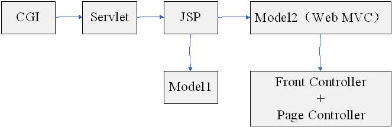
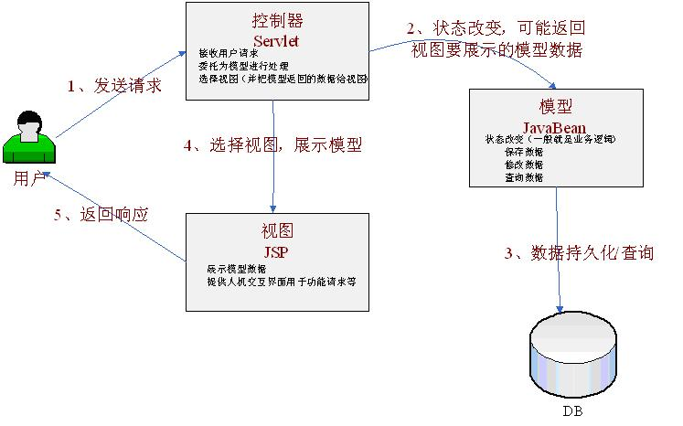
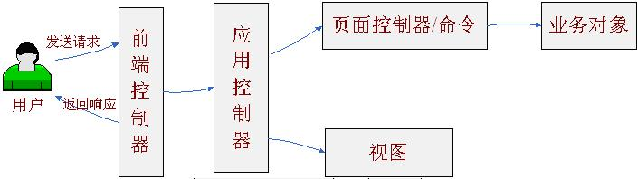

# Web MVC简介

## Web开发中的请求-响应模型：


在Web世界里，具体步骤如下：
1、 Web浏览器（如IE）发起请求，如访问http://sishuok.com
2、 Web服务器（如Tomcat）接收请求，处理请求（比如用户新增，则将把用户保存一下），最后产生响应（一般为html）。
3、web服务器处理完成后，返回内容给web客户端（一般就是我们的浏览器），客户端对接收的内容进行处（如web浏览器将会对接收到的html内容进行渲染以展示给客户）。
因此，在Web世界里：
都是Web客户端发起请求，Web服务器接收、处理并产生响应。
一般Web服务器是不能主动通知Web客户端更新内容。虽然现在有些技术如服务器推（如Comet）、还有现在的
HTML5 websocket可以实现Web服务器主动通知Web客户端。
到此我们了解了在web开发时的请求/响应模型，接下来我们看一下标准的MVC模型是什么。

## 标准MVC模型概述
MVC模型：是一种架构型的模式，本身不引入新功能，只是帮助我们将开发的结构组织的更加合理，使展示与模型分离、流程控制逻辑、业务逻辑调用与展示逻辑分离。如图1-2

首先让我们了解下MVC（Model-View-Controller）三元组的概念：

### Model（模型）

数据模型，提供要展示的数据，因此包含数据和行为，可以认为是领域模型或JavaBean组件（包含数据和行为），不过现在一般都分离开来：Value Object（数据） 和 服务层（行为）。也就是模型提供了模型数据查
询和模型数据的状态更新等功能，包括数据和业务。

### View（视图）

负责进行模型的展示，一般就是我们见到的用户界面，客户想看到的东西。

### Controller（控制器）

接收用户请求，委托给模型进行处理（状态改变），处理完毕后把返回的模型数据返回给视图，由视图负责展示。 也就是说控制器做了个调度员的工作，。
从图1-1我们还看到，在标准的MVC中模型能主动推数据给视图进行更新（观察者设计模式，在模型上注册视图，当模型更新时自动更新视图），但在Web开发中模型是无法主动推给视图（无法主动更新用户界面），因为在Web开发是请求-响应模型。

那接下来我们看一下在Web里MVC是什么样子，我们称其为 Web MVC 来区别标准的MVC。

## 1.3、Web MVC概述
模型-视图-控制器概念和标准MVC概念一样，请参考1.2，我们再看一下Web MVC标准架构，如图1-3：


在Web MVC模式下，模型无法主动推数据给视图，如果用户想要视图更新，需要再发送一次请求（即请求-响应模
型）。
概念差不多了，我们接下来了解下Web端开发的发展历程，和使用代码来演示一下Web MVC是如何实现的，还有为什么要使用MVC这个模式呢？

## 1.4、Web端开发发展历程
此处我们只是简单的叙述比较核心的历程，如图1-4



### CGI：

（Common Gateway Interface）公共网关接口，一种在web服务端使用的脚本技术，使用C或Perl语言编写，用于接收web用户请求并处理，最后动态产生响应给用户，但每次请求将产生一个进程，重量级。

### Servlet：

一种JavaEE web组件技术，是一种在服务器端执行的web组件，用于接收web用户请求并处理，最后
动态产生响应给用户。但每次请求只产生一个线程（而且有线程池），轻量级。而且能利用许多JavaEE技术（如JDBC等）。本质就是在java代码里面 输出 html流。但表现逻辑、控制逻辑、业务逻辑调用混杂。

```java
/**
 * 用户登陆页
 *
 * @author TomLuo
 * @date 2020/3/28
 */
public class LoginServlet extends HttpServlet {
    @Override
    protected void doGet(HttpServletRequest req, HttpServletResponse resp) throws ServletException, IOException {
        doPost(req, resp);
    }

    /**
     * 控制逻辑，根据请求参数选择要执行的功能方法
     * @param req
     * @param resp
     * @throws ServletException
     * @throws IOException
     */
    @Override
    protected void doPost(HttpServletRequest req, HttpServletResponse resp) throws ServletException, IOException {
        final String submitFlag = req.getParameter("submitFlag");
        if (StringUtils.equals(submitFlag, "toLogin")) {
            toLogin(req, resp);
            return;
        } else if (StringUtils.equals(submitFlag, "login")) {
            login(req, resp);
            return;
        }
        toLogin(req, resp);
    }

    /**
     * 调用业务对象javabean对象，进行登陆，即模型，不仅包含数据还有行为
     * @param req
     * @param resp
     * @throws IOException
     */
    private void login(HttpServletRequest req, HttpServletResponse resp) throws IOException {
        final String username = req.getParameter("username");
        final String password = req.getParameter("password");
        final UserBean userBean = new UserBean(username, password);
        if (userBean.login()) {
            resp.getWriter().write("login success");
        } else {
            resp.getWriter().write("login failed");
        }
    }

    /**
     * 表现代码，页面展示直接放在我们的servlet里面
     * @param req
     * @param resp
     * @throws IOException
     */
    private void toLogin(HttpServletRequest req, HttpServletResponse resp) throws IOException {
        resp.setContentType(MediaType.TEXT_HTML_VALUE);
        String loginPath = req.getContextPath() + "/servletLogin";
        final PrintWriter writer = resp.getWriter();
        final StringBuffer stringBuffer = new StringBuffer();
        stringBuffer.append("<form action='" + loginPath + "' method='post'>");
        stringBuffer.append("<input type='hidden' name='submitFlag' value='login'/></br>");
        stringBuffer.append("Username: <input type='text' name='username'/></br>");
        stringBuffer.append("Password: <input type='password' name='password'/></br>");
        stringBuffer.append("<input type='submit' name='login'/></br>");
        stringBuffer.append("</form>");
        writer.write(stringBuffer.toString());
    }
}
```

这种做法是绝对不可取的，控制逻辑、表现代码、业务逻辑对象调用混杂在一起，最大的问题是直接在Java
代码里面输出Html，这样前端开发人员无法进行页面风格等的设计与修改，即使修改也是很麻烦，因此实际项目这种做法不可取。

### JSP

（Java Server Page）：一种在服务器端执行的web组件，是一种运行在标准的HTML页面中嵌入脚本语言（现在只支持Java）的模板页面技术。本质就是在html代码中嵌入java代码。JSP最终还是会被编译为Servlet，只不过比纯Servlet开发页面更简单、方便。但表现逻辑、控制逻辑、业务逻辑调用还是混杂。

```jsp
<%@page import="com.tom.domain.UserBean" %>
<%@ page language="java" contentType="text/html; charset=UTF-8" pageEncoding="UTF-8" %>
<!DOCTYPE html PUBLIC "-//W3C//DTD HTML 4.01 Transitional//EN" "http://www.w3.org/TR/html4/loose.dtd">
<html>
<head>
    <meta http-equiv="content-type" content="text/html;charset=UTF-8">
    <title>Login</title>
</head>
<body>
<%
    final String submitFlag = request.getParameter("submitFlag");
    if ("login".equals(submitFlag)) {
        final String username = request.getParameter("username");
        final String password = request.getParameter("password");
        final UserBean userBean = new UserBean(username, password);
        if (userBean.login()) {
            out.write("login success");
        } else {
            out.write("login failed");
        }
    } else %>
</body>
</html>
```

这种做法也是绝对不可取的，控制逻辑、表现代码、业务逻辑对象调用混杂在一起，但比直接在servlet里输出html要好一点，前端开发人员可以进行简单的页面风格等的设计与修改（但如果嵌入的java脚本太多也是很难修改的），因此实际项目这种做法不可取。


JSP本质还是Servlet，最终在运行时会生成一个Servlet（如tomcat，将在tomcat\work\Catalina\web应用名\org\
apache\jsp下生成），但这种使得写html简单点，但仍是控制逻辑、表现代码、业务逻辑对象调用混杂在一起。

### Model1：可以认为是JSP的增强版，可以认为是jsp+javabean
特点：使用<jsp:useBean>标准动作，自动将请求参数封装为JavaBean组件；还必须使用java脚本执行控制逻辑。

```jsp
<%@page import="com.tom.domain.UserBean" %>
<%@ page language="java" contentType="text/html; charset=UTF-8" pageEncoding="UTF-8" %>
<!DOCTYPE html PUBLIC "-//W3C//DTD HTML 4.01 Transitional//EN" "http://www.w3.org/TR/html4/loose.dtd">
<html>
<head>
    <meta http-equiv="content-type" content="text/html;charset=UTF-8">
    <title>Login</title>
</head>
<body>
<jsp:useBean id="userBean" class="com.tom.domain.UserBean"/>
<jsp:setProperty name="userBean" property="*"/>
<%
    final String submitFlag = request.getParameter("submitFlag");
    if ("login".equals(submitFlag)) {
        if (userBean.login()) {
            out.write("login success");
        } else {
            out.write("login failed");
        }
    } else %>
</body>
</html>
```

此处我们可以看出，使用<jsp:useBean>标准动作可以简化javabean的获取/创建，及将请求参数封装到javabean，再
看一下Model1架构，如图1-8


Model1架构中，JSP负责控制逻辑、表现逻辑、业务对象（javabean）的调用，只是比纯JSP简化了获取请求参数和封装请求参数。同样是不好的，在项目中应该严禁使用（或最多再demo里使用）。

### Model2：在JavaEE世界里，它可以认为就是Web MVC模型
Model2架构其实可以认为就是我们所说的Web MVC模型，只是控制器采用Servlet、模型采用JavaBean、视图采用JSP



具体代码事例如下：

模型

```java
@Data
@NoArgsConstructor
@AllArgsConstructor
@Slf4j
public class UserBean {
    String username;
    String password;
    public boolean login() {
        log.info("{}", JSON.toJSONString(this,true));
        if (StringUtils.equals(this.username, "tom") && StringUtils.equals(this.password, "123456")) {
            return true;
        }
        return false;
    }
}
```

视图

```jsp
<%@page import="com.tom.domain.UserBean" %>
<%@ page language="java" contentType="text/html; charset=UTF-8" pageEncoding="UTF-8" %>
<!DOCTYPE html PUBLIC "-//W3C//DTD HTML 4.01 Transitional//EN" "http://www.w3.org/TR/html4/loose.dtd">
<html>
<head>
    <meta http-equiv="content-type" content="text/html;charset=UTF-8">
    <title>Login</title>
</head>
<body>
<form action="${pageContext.request.contextPath}/model2Login" method="post">
    <input type="hidden" name="submitFlag" value="login"/>
    username:<input type="text" name="username" value="${user.username}"/><br/>
    password:<input type="password" name="password"/><br/>
    <input type="submit" value="login"/>
</form>
</body>
</html>
```

控制器

```java
public class Model2Login extends HttpServlet {
    @Override
    protected void doGet(HttpServletRequest req, HttpServletResponse resp) throws ServletException, IOException {
        doPost(req, resp);
    }

    /**
     * 控制逻辑，根据请求参数选择要执行的功能方法
     *
     * @param req
     * @param resp
     * @throws ServletException
     * @throws IOException
     */
    @Override
    protected void doPost(HttpServletRequest req, HttpServletResponse resp) throws ServletException, IOException {
        final String submitFlag = req.getParameter("submitFlag");
        if (StringUtils.equals(submitFlag, "toLogin")) {
            toLogin(req, resp);
            return;
        } else if (StringUtils.equals(submitFlag, "login")) {
            login(req, resp);
            return;
        }
        toLogin(req, resp);
    }

    /**
     * 调用业务对象javabean对象，进行登陆，即模型，不仅包含数据还有行为
     *
     * @param req
     * @param resp
     * @throws IOException
     */
    private void login(HttpServletRequest req, HttpServletResponse resp) throws IOException, ServletException {
        final String username = req.getParameter("username");
        final String password = req.getParameter("password");
        final UserBean userBean = new UserBean(username, password);
        if (userBean.login()) {
            resp.sendRedirect(req.getContextPath() + "/mvc/success.jsp");
        } else {
            req.setAttribute("user", userBean);
            toLogin(req, resp);
        }
    }

    /**
     * 表现代码，页面展示直接放在我们的servlet里面
     *
     * @param req
     * @param resp
     * @throws IOException
     */
    private void toLogin(HttpServletRequest req, HttpServletResponse resp) throws IOException, ServletException {
        req.getRequestDispatcher("/mvc/login.jsp").forward(req, resp);
    }
}
```

从Model2架构可以看出，视图和模型分离了，控制逻辑和展示逻辑分离了。
但我们也看到严重的缺点：

* 控制器：
  控制逻辑可能比较复杂，其实我们可以按照规约，如请求参数submitFlag=toAdd，我们其实可以直接调用
  toAdd方法，来简化控制逻辑；而且每个模块基本需要一个控制器，造成控制逻辑可能很复杂；
  请求参数到模型的封装比较麻烦，如果能交给框架来做这件事情，我们可以从中得到解放；
  选择下一个视图，严重依赖Servlet API，这样很难或基本不可能更换视图；
  给视图传输要展示的模型数据，使用Servlet API，更换视图技术也要一起更换，很麻烦。
* 模型：
  此处模型使用JavaBean，可能造成JavaBean组件类很庞大，一般现在项目都是采用三层架构，而不采用
  JavaBean。
* 视图
  现在被绑定在JSP，很难更换视图，比如Velocity、FreeMarker；比如我要支持Excel、PDF视图等等。

## 服务到工作者：Front Controller + Application Controller + Page Controller + Context

即，前端控制器+应用控制器+页面控制器（也有称其为动作）+上下文，也是Web MVC，只是责任更加明确，详情请
参考《核心J2EE设计模式》和《企业应用架构模式》如图1-10：



运行流程如下：


职责：
Front Controller：

前端控制器，负责为表现层提供统一访问点，从而避免Model2中出现的重复的控制逻辑（由前端控制器统一回调相应的功能方法，如前边的根据submitFlag=login转调login方法）；并且可以为多个请求提供共用的逻辑（如准备上下文等等），将选择具体视图和具体的功能处理（如login里边封装请求参数到模型，并调用业务逻辑
对象）分离。

Application Controller：

应用控制器，前端控制器分离选择具体视图和具体的功能处理之后，需要有人来管理，应用控制器就是用来选择具体视图技术（视图的管理）和具体的功能处理（页面控制器/命令对象/动作管理），一种策略设计模式的应用，可以很容易的切换视图/页面控制器，相互不产生影响。
Page Controller(Command)：

页面控制器/动作/处理器：功能处理代码，收集参数、封装参数到模型，转调业务对象处理模型，返回逻辑视图名交给前端控制器（和具体的视图技术解耦），由前端控制器委托给应用控制器选择具体的视图来展示，可以是命令设计模式的实现。页面控制器也被称为处理器或动作。
Context：

上下文，还记得Model2中为视图准备要展示的模型数据吗，我们直接放在request中（Servlet API相关），有了上下文之后，我们就可以将相关数据放置在上下文，从而与协议无关（如Servlet API）的访问/设置模型数据，一般通过ThreadLocal模式实现。
到此，我们回顾了整个web开发架构的发展历程，可能不同的web层框架在细节处理方面不同，但的目的是一样的：
干净的web表现层：
模型和视图的分离；
控制器中的控制逻辑与功能处理分离（收集并封装参数到模型对象、业务对象调用）；
控制器中的视图选择与具体视图技术分离。

轻薄的web表现层：
做的事情越少越好，薄薄的，不应该包含无关代码；
只负责收集并组织参数到模型对象，启动业务对象的调用；

控制器只返回逻辑视图名并由相应的应用控制器来选择具体使用的视图策略；
尽量少使用框架特定API，保证容易测试。