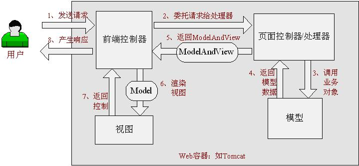
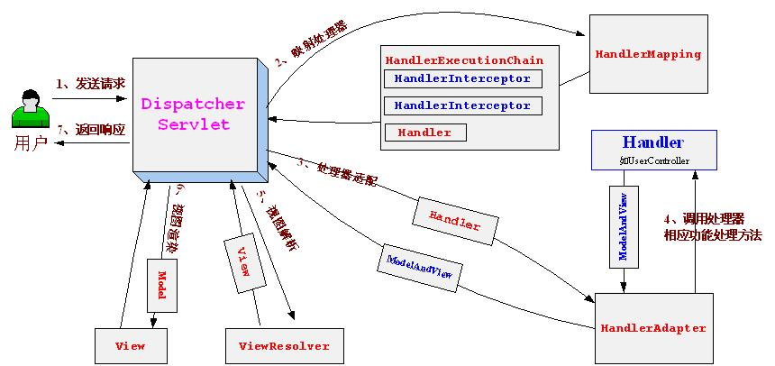
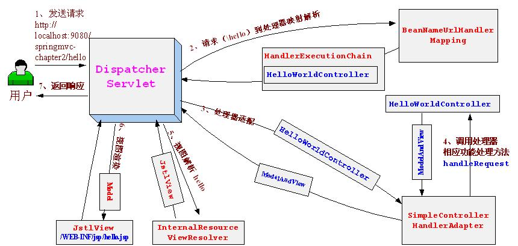

# Spring mvc入门

## Spring Web MVC是什么
Spring Web MVC是一种基于Java的实现了Web MVC设计模式的请求驱动类型的轻量级Web框架，即使用了MVC架构模式的思想，将web层进行职责解耦，基于请求驱动指的就是使用请求-响应模型，框架的目的就是帮助我们简化开发，Spring Web MVC也是要简化我们日常Web开发的。
另外还有一种基于组件的、事件驱动的Web框架在此就不介绍了，如Tapestry、JSF等。
Spring Web MVC也是服务到工作者模式的实现，但进行可优化。前端控制器是DispatcherServlet；应用控制器其
实拆为处理器映射器(Handler Mapping)进行处理器管理和视图解析器(View Resolver)进行视图管理；页面控制器/动作/处理器为Controller接口（仅包含ModelAndView handleRequest(request, response) 方法）的实现（也可以是任何的POJO类）；支持本地化（Locale）解析、主题（Theme）解析及文件上传等；提供了非常灵活的数据验证、格式化和数据绑定机制；提供了强大的约定大于配置（惯例优先原则）的契约式编程支持。

## Spring Web MVC能帮我们做什么

* 让我们能非常简单的设计出干净的Web层和薄薄的Web层；
* 进行更简洁的Web层的开发；
* 天生与Spring框架集成（如IoC容器、AOP等）；
* 提供强大的约定大于配置的契约式编程支持；
* 能简单的进行Web层的单元测试；
* 支持灵活的URL到页面控制器的映射；
* 非常容易与其他视图技术集成，如Velocity、FreeMarker等等，因为模型数据不放在特定的API里，而是放在一个Model里（Map数据结构实现，因此很容易被其他框架使用）；
* 非常灵活的数据验证、格式化和数据绑定机制，能使用任何对象进行数据绑定，不必实现特定框架的API；
* 提供一套强大的JSP标签库，简化JSP开发；
* 支持灵活的本地化、主题等解析；
* 更加简单的异常处理；
* 对静态资源的支持；
* 支持Restful风格。
## Spring Web MVC架构
Spring Web MVC框架也是一个基于请求驱动的Web框架，并且也使用了前端控制器模式来进行设计，再根据请求映射规则分发给相应的页面控制器（动作/处理器）进行处理。首先让我们整体看一下Spring Web MVC处理请求的流程：

### Spring Web MVC处理请求的流程



具体执行步骤如下：
1、 首先用户发送请求————>前端控制器，前端控制器根据请求信息（如URL）来决定选择哪一个页面控制器进行处理并把请求委托给它，即以前的控制器的控制逻辑部分；图2-1中的1、2步骤；
2、 页面控制器接收到请求后，进行功能处理，首先需要收集和绑定请求参数到一个对象，这个对象在Spring WebMVC中叫命令对象，并进行验证，然后将命令对象委托给业务对象进行处理；处理完毕后返回一个
ModelAndView（模型数据和逻辑视图名）；图2-1中的3、4、5步骤；
3、 前端控制器收回控制权，然后根据返回的逻辑视图名，选择相应的视图进行渲染，并把模型数据传入以便视图渲染；图2-1中的步骤6、7；
4、 前端控制器再次收回控制权，将响应返回给用户，图2-1中的步骤8；至此整个结束。
问题：
1、 请求如何给前端控制器？
2、 前端控制器如何根据请求信息选择页面控制器进行功能处理？
3、 如何支持多种页面控制器呢？
4、 如何页面控制器如何使用业务对象？
5、 页面控制器如何返回模型数据？
6、 前端控制器如何根据页面控制器返回的逻辑视图名选择具体的视图进行渲染？
7、 不同的视图技术如何使用相应的模型数据？
首先我们知道有如上问题，那这些问题如何解决呢？请让我们先继续，在后边依次回答。

### Spring Web MVC架构
1、Spring Web MVC核心架构图，如图2-2



架构图对应的DispatcherServlet核心代码如下：

```java
//前端控制器分派方法
protected void doDispatch(HttpServletRequest request, HttpServletResponse response) throws Exception {
    HttpServletRequest processedRequest = request;
    HandlerExecutionChain mappedHandler = null;
    int interceptorIndex = -1;
    try {
        ModelAndView mv;
        boolean errorView = false;

        try {
            //检查是否是请求是否是multipart（如文件上传），如果是将通过MultipartResolver解析
            processedRequest = checkMultipart(request);
            //步骤2、请求到处理器（页面控制器）的映射，通过HandlerMapping进行映射
            mappedHandler = getHandler(processedRequest, false);
            if (mappedHandler == null || mappedHandler.getHandler() == null) {
                noHandlerFound(processedRequest, response);
                return;
            }
            //步骤3、处理器适配，即将我们的处理器包装成相应的适配器（从而支持多种类型的处理器）
            HandlerAdapter ha = getHandlerAdapter(mappedHandler.getHandler());
            // 304 Not Modified缓存支持
            //此处省略具体代码
            // 执行处理器相关的拦截器的预处理（HandlerInterceptor.preHandle）
            //此处省略具体代码
            // 步骤4、由适配器执行处理器（调用处理器相应功能处理方法）
            mv = ha.handle(processedRequest, response, mappedHandler.getHandler());
            // Do we need view name translation?
            if (mv != null && !mv.hasView()) {
                mv.setViewName(getDefaultViewName(request));
            }
            // 执行处理器相关的拦截器的后处理（HandlerInterceptor.postHandle）
            //此处省略具体代码
        } catch (ModelAndViewDefiningException ex) {
            logger.debug("ModelAndViewDefiningException encountered", ex);
            mv = ex.getModelAndView();
        } catch (Exception ex) {
            Object handler = (mappedHandler != null ? mappedHandler.getHandler() : null);
            mv = processHandlerException(processedRequest, response, handler, ex);

            errorView = (mv != null);
        }
        //步骤5 步骤6、解析视图并进行视图的渲染
        //步骤5 由ViewResolver解析View（viewResolver.resolveViewName(viewName, locale)）
        //步骤6 视图在渲染时会把Model传入（view.render(mv.getModelInternal(), request, response);）
        if (mv != null && !mv.wasCleared()) {
            render(mv, processedRequest, response);
            if (errorView) {
                WebUtils.clearErrorRequestAttributes(request);
            }
        } else {
            if (logger.isDebugEnabled()) {
                logger.debug("Null ModelAndView returned to DispatcherServlet with name '" + getServletName() +
                             "': assuming HandlerAdapter completed request handling");
            }
        }
        // 执行处理器相关的拦截器的完成后处理（HandlerInterceptor.afterCompletion）
        //此处省略具体代码
        catch(Exception ex){
            // Trigger after-completion for thrown exception.
            triggerAfterCompletion(mappedHandler, interceptorIndex, processedRequest, response, ex);
            throw ex;
        }
        catch(Error err){
            ServletException ex = new NestedServletException("Handler processing failed", err);
            // Trigger after-completion for thrown exception.
            triggerAfterCompletion(mappedHandler, interceptorIndex, processedRequest, response, ex);
            throw ex;
        }
        finally{
            // Clean up any resources used by a multipart request.
            if (processedRequest != request) {
                cleanupMultipart(processedRequest);
            }
        }
    }
}
```

核心架构的具体流程步骤如下：
1、 首先用户发送请求——>DispatcherServlet，前端控制器收到请求后自己不进行处理，而是委托给其他的解析器进行处理，作为统一访问点，进行全局的流程控制；
2、 DispatcherServlet——>HandlerMapping， HandlerMapping将会把请求映射为HandlerExecutionChain对象（包含一个Handler处理器（页面控制器）对象、多个HandlerInterceptor拦截器）对象，通过这种策略模式，很容易添加新的映射策略；
3、 DispatcherServlet——>HandlerAdapter，HandlerAdapter将会把处理器包装为适配器，从而支持多种类型的处理器，即适配器设计模式的应用，从而很容易支持很多类型的处理器；
4、 HandlerAdapter——>处理器功能处理方法的调用，HandlerAdapter将会根据适配的结果调用真正的处理器的功能处理方法，完成功能处理；并返回一个ModelAndView对象（包含模型数据、逻辑视图名）；
5、 ModelAndView的逻辑视图名——> ViewResolver， ViewResolver将把逻辑视图名解析为具体的View，通过这种策略模式，很容易更换其他视图技术；
6、 View——>渲染，View会根据传进来的Model模型数据进行渲染，此处的Model实际是一个Map数据结构，因此很容易支持其他视图技术；
7、返回控制权给DispatcherServlet，由DispatcherServlet返回响应给用户，到此一个流程结束。
此处我们只是讲了核心流程，没有考虑拦截器、本地解析、文件上传解析等，后边再细述。
到此，再来看我们前边提出的问题：
1、 请求如何给前端控制器？这个应该在web.xml中进行部署描述，在HelloWorld中详细讲解。
2、 前端控制器如何根据请求信息选择页面控制器进行功能处理？ 我们需要配置HandlerMapping进行映射
3、 如何支持多种页面控制器呢？配置HandlerAdapter从而支持多种类型的页面控制器
4、 如何页面控制器如何使用业务对象？可以预料到，肯定利用Spring IoC容器的依赖注入功能
5、 页面控制器如何返回模型数据？使用ModelAndView返回
6、 前端控制器如何根据页面控制器返回的逻辑视图名选择具体的视图进行渲染？ 使用ViewResolver进行解析
7、 不同的视图技术如何使用相应的模型数据？ 因为Model是一个Map数据结构，很容易支持其他视图技术
在此我们可以看出具体的核心开发步骤：
1、 DispatcherServlet在web.xml中的部署描述，从而拦截请求到Spring Web MVC
2、 HandlerMapping的配置，从而将请求映射到处理器
3、 HandlerAdapter的配置，从而支持多种类型的处理器
4、 ViewResolver的配置，从而将逻辑视图名解析为具体视图技术
5、处理器（页面控制器）的配置，从而进行功能处理上边的开发步骤我们会在Hello World中详细验证。

### Spring Web MVC优势

1、清晰的角色划分：前端控制器（DispatcherServlet）、请求到处理器映射（HandlerMapping）、处理器适配器（HandlerAdapter）、视图解析器（ViewResolver）、处理器或页面控制器（Controller）、验证器（
Validator）、命令对象（Command 请求参数绑定到的对象就叫命令对象）、表单对象（Form Object 提供给表单展示和提交到的对象就叫表单对象）。
2、分工明确，而且扩展点相当灵活，可以很容易扩展，虽然几乎不需要；
3、由于命令对象就是一个POJO，无需继承框架特定API，可以使用命令对象直接作为业务对象；
4、和Spring 其他框架无缝集成，是其它Web框架所不具备的；
5、可适配，通过HandlerAdapter可以支持任意的类作为处理器；
6、可定制性，HandlerMapping、ViewResolver等能够非常简单的定制；
7、功能强大的数据验证、格式化、绑定机制；
8、利用Spring提供的Mock对象能够非常简单的进行Web层单元测试；
9、本地化、主题的解析的支持，使我们更容易进行国际化和主题的切换。
10、强大的JSP标签库，使JSP编写更容易。
11、还有比如RESTful风格的支持、简单的文件上传、约定大于配置的契约式编程支持、基于注解的零配置支持
等等。
到此我们已经简单的了解了Spring Web MVC，接下来让我们来个实例来具体使用下这个框架。

## Hello World入门
### 准备开发环境和运行环境

pom.xml

```xml
<project xmlns:xsi="http://www.w3.org/2001/XMLSchema-instance" xmlns="http://maven.apache.org/POM/4.0.0"
         xsi:schemaLocation="http://maven.apache.org/POM/4.0.0 http://maven.apache.org/xsd/maven-4.0.0.xsd">
    <modelVersion>4.0.0</modelVersion>

    <groupId>com.tom</groupId>
    <artifactId>spring-mvc-introduce</artifactId>
    <version>1.0.0-SNAPSHOT</version>
    <packaging>war</packaging>
    <name>spring-mvc-introduce</name>
    <properties>
        <project.build.sourceEncoding>UTF-8</project.build.sourceEncoding>
        <maven.compiler.source>1.8</maven.compiler.source>
        <maven.compiler.target>1.8</maven.compiler.target>
        <maven-war-plugin.version>3.0.0</maven-war-plugin.version>
    </properties>
    <dependencies>
        <dependency>
            <groupId>javax.servlet</groupId>
            <artifactId>javax.servlet-api</artifactId>
            <version>4.0.1</version>
            <scope>provided</scope>
        </dependency>
        <dependency>
            <groupId>org.apache.commons</groupId>
            <artifactId>commons-lang3</artifactId>
            <version>3.9</version>
            <scope>compile</scope>
        </dependency>
        <dependency>
            <groupId>org.projectlombok</groupId>
            <artifactId>lombok</artifactId>
            <version>1.18.10</version>
            <scope>provided</scope>
        </dependency>
        <dependency>
            <groupId>org.slf4j</groupId>
            <artifactId>slf4j-simple</artifactId>
            <version>2.0.0-alpha1</version>
        </dependency>
        <dependency>
            <groupId>org.springframework</groupId>
            <artifactId>spring-webmvc</artifactId>
            <version>5.2.3.RELEASE</version>
            <scope>compile</scope>
        </dependency>
        <dependency>
            <groupId>com.alibaba</groupId>
            <artifactId>fastjson</artifactId>
            <version>1.2.62</version>
            <scope>compile</scope>
        </dependency>
        <dependency>
            <groupId>javax.servlet</groupId>
            <artifactId>jstl</artifactId>
            <version>1.2</version>
            <scope>compile</scope>
        </dependency>
    </dependencies>
    <build>
        <finalName>spring-mvc-introduce</finalName>
        <pluginManagement>
            <plugins>
                <plugin>
                    <groupId>org.apache.maven.plugins</groupId>
                    <artifactId>maven-war-plugin</artifactId>
                    <version>${maven-war-plugin.version}</version>
                    <configuration>
                        <warSourceDirectory>src/main/webapp</warSourceDirectory>
                        <failOnMissingWebXml>false</failOnMissingWebXml>
                    </configuration>
                </plugin>
            </plugins>
        </pluginManagement>
    </build>
</project>
```

### 前端控制器的配置
在我们的web.xml中添加如下配置：

```xml
<servlet>
    <servlet-name>api</servlet-name>
    <servlet-class>org.springframework.web.servlet.DispatcherServlet</servlet-class>
    <load-on-startup>1</load-on-startup>
</servlet>

<servlet-mapping>
    <servlet-name>api</servlet-name>
    <url-pattern>/</url-pattern>
</servlet-mapping>
```

load-on-startup：表示启动容器时初始化该Servlet；
url-pattern：表示哪些请求交给Spring Web MVC处理， “/” 是用来定义默认servlet映射的。也可以如“*.html”
表示拦截所有以html为扩展名的请求。
自此请求已交给Spring Web MVC框架处理，因此我们需要配置Spring的配置文件，默认DispatcherServlet会加载
WEB-INF/[DispatcherServlet的Servlet名字]-servlet.xml配置文件。本示例为WEB-INF/ api-servlet.xml。
### 在Spring配置文件中配置HandlerMapping、HandlerAdapter
具体配置在WEB-INF/ api-servlet.xml文件中：

```xml
<!-- HandlerMapping -->
<bean class="org.springframework.web.servlet.handler.BeanNameUrlHandlerMapping"/>
<!-- HandlerAdapter -->
<bean class="org.springframework.web.servlet.mvc.SimpleControllerHandlerAdapter"/>
```

BeanNameUrlHandlerMapping：表示将请求的URL和Bean名字映射，如URL为 “上下文/hello”，则Spring配置文件必须有一个名字为“/hello”的Bean，上下文默认忽略。
SimpleControllerHandlerAdapter：表示所有实现了org.springframework.web.servlet.mvc.Controller接口的Bean可以作为Spring Web MVC中的处理器。如果需要其他类型的处理器可以通过实现HadlerAdapter来解决。

### 在Spring配置文件中配置ViewResolver
具体配置在WEB-INF/ api-servlet.xml文件中：

```xml
 <!-- 视图解析器 -->
<bean class="org.springframework.web.servlet.view.InternalResourceViewResolver">
   <property name="viewClass" value="org.springframework.web.servlet.view.JstlView"/>
   <property name="prefix" value="/WEB-INF/view/"/>
   <property name="suffix" value=".jsp"/>
</bean>
```

InternalResourceViewResolver：用于支持Servlet、JSP视图解析；
viewClass：JstlView表示JSP模板页面需要使用JSTL标签库，classpath中必须包含jstl的相关jar包；
prefix和suffix：查找视图页面的前缀和后缀（前缀[逻辑视图名]后缀），比如传进来的逻辑视图名为hello，则该该jsp视图页面应该存放在“WEB-INF/view/hello.jsp”；

### 开发处理器/页面控制器

```java
public class HelloWorldController implements Controller {

    @Override
    public ModelAndView handleRequest(HttpServletRequest req, HttpServletResponse resp) throws Exception {
//1、收集参数、验证参数
//2、绑定参数到命令对象
//3、将命令对象传入业务对象进行业务处理
//4、选择下一个页面
        ModelAndView mv = new ModelAndView();
//添加模型数据 可以是任意的POJO对象
        mv.addObject("message", "Hello World!");
//设置逻辑视图名，视图解析器会根据该名字解析到具体的视图页面
        mv.setViewName("hello");
        return mv;
    }
}
```

org.springframework.web.servlet.mvc.Controller：页面控制器/处理器必须实现Controller接口，注意别选错了；后边我们会学习其他的处理器实现方式；

* public ModelAndView handleRequest(HttpServletRequest req, HttpServletResponse resp) ：

  功能处理方法，实现相应的功能处理，比如收集参数、验证参数、绑定参数到命令对象、将命令对象传入业务对象进行业务处理、最后返回ModelAndView对象；
*  ModelAndView：

  包含了视图要实现的模型数据和逻辑视图名；
  
  “mv.addObject("message", "Hello World!");
  ”表示添加模型数据，此处可以是任意POJO对象；
  
  “mv.setViewName("hello");”表示设置逻辑视图名为“hello”，视图解析器会将其解析为具体的视	图，如前边的视图解析器InternalResourceVi。wResolver会将其解析为“WEB-INF/view/hello.jsp”。

我们需要将其添加到Spring配置文件(WEB-INF/api-servlet.xml)，让其接受Spring IoC容器管理:

```xml
<!-- 处理器 -->
<bean name="/hello" class="com.tom.web.HelloWorldController"/>
```

name="/hello"：前边配置的BeanNameUrlHandlerMapping，表示如过请求的URL为 “上下文/hello”，则将会交
给该Bean进行处理。
### 开发视图页面
创建 /WEB-INF/view/hello.jsp视图页面：

```jsp
<%@ page contentType="text/html;charset=UTF-8" language="java" %>
<html>
<head>
    <title>Title</title>
</head>
<body>
${message}
</body>
</html>
```

${message}：表示显示由HelloWorldController处理器传过来的模型数据。
### 启动服务器运行测试
通过请求：http://localhost:8080/hello ，如果页面输出“Hello World! ”就表明我们成功了！

### 运行流程分析



运行步骤：
1、 首先用户发送请求http://localhost:8080/hello——>web容器，web容器根据“/hello”
路径映射到DispatcherServlet（url-pattern为/）进行处理；
2、 DispatcherServlet——>BeanNameUrlHandlerMapping进行请求到处理的映射，
BeanNameUrlHandlerMapping将“/hello”路径直接映射到名字为“/hello”的Bean进行处理，即
HelloWorldController，BeanNameUrlHandlerMapping将其包装为HandlerExecutionChain（只包括
HelloWorldController处理器，没有拦截器）；
3、 DispatcherServlet——> SimpleControllerHandlerAdapter，SimpleControllerHandlerAdapter将
HandlerExecutionChain中的处理器（HelloWorldController）适配为SimpleControllerHandlerAdapter；
4、 SimpleControllerHandlerAdapter——> HelloWorldController处理器功能处理方法的调用，
SimpleControllerHandlerAdapter将会调用处理器的handleRequest方法进行功能处理，该处理方法返回一个
ModelAndView给DispatcherServlet；
5、 hello（ModelAndView的逻辑视图名）——>InternalResourceViewResolver，
InternalResourceViewResolver使用JstlView，具体视图页面在/WEB-INF/jsp/hello.jsp；
6、 JstlView（/WEB-INF/jsp/hello.jsp）——>渲染，将在处理器传入的模型数据(message=HelloWorld！)在视图
中展示出来；
7、 返回控制权给DispatcherServlet，由DispatcherServlet返回响应给用户，到此一个流程结束。
到此HelloWorld就完成了，步骤是不是有点多？而且回忆下我们主要进行了如下配置：
1、 前端控制器DispatcherServlet；
2、 HandlerMapping
3、 HandlerAdapter
4、 ViewResolver
5、 处理器/页面控制器
6、 视图
因此，接下来几章让我们详细看看这些配置，先从DispatcherServlet开始吧。

## POST中文乱码解决方案

spring Web MVC框架提供了org.springframework.web.filter.CharacterEncodingFilter用于解决POST方式造成的中文乱码问题，具体配置如下：

```xml
<filter>
    <filter-name>CharacterEncodingFilter</filter-name>
    <filter-class>org.springframework.web.filter.CharacterEncodingFilter</filter-class>
    <init-param>
        <param-name>encoding</param-name>
        <param-value>utf-8</param-value>
    </init-param>
</filter>
<filter-mapping>
    <filter-name>CharacterEncodingFilter</filter-name>
    <url-pattern>/*</url-pattern>
</filter-mapping>
```

以后我们项目及所有页面的编码均为UTF-8。
## Spring各版本特性
### Spring2.5之前

我们都是通过实现Controller接口或其实现来定义我们的处理器类。

### Spring2.5引入注解式处理器支持

通过@Controller 和 @RequestMapping注解定义我们的处理器类。并且提供了一组强大的注解：
需要通过处理器映射DefaultAnnotationHandlerMapping和处理器适配器AnnotationMethodHandlerAdapter来开启支持@Controller 和 @RequestMapping注解的处理器。
@Controller：用于标识是处理器类；
@RequestMapping：请求到处理器功能方法的映射规则；
@RequestParam：请求参数到处理器功能处理方法的方法参数上的绑定；
@ModelAttribute：请求参数到命令对象的绑定；
@SessionAttributes：用于声明session级别存储的属性，放置在处理器类上，通常列出模型属性（如
@ModelAttribute 对应的名称，则这些属性会透明的保存到session中；
@InitBinder：自定义数据绑定注册支持，用于将请求参数转换到命令对象属性的对应类型；

### Spring3.0引入RESTful架构风格

支持(通过@PathVariable注解和一些其他特性支持),且又引入了更多的注解支持：
@CookieValue：cookie数据到处理器功能处理方法的方法参数上的绑定；
@RequestHeader：请求头（header）数据到处理器功能处理方法的方法参数上的绑定；
@RequestBody：请求的body体的绑定（通过HttpMessageConverter进行类型转换）；
@ResponseBody：处理器功能处理方法的返回值作为响应体（通过HttpMessageConverter进行类型转换）；
@ResponseStatus：定义处理器功能处理方法/异常处理器返回的状态码和原因；
@ExceptionHandler：注解式声明异常处理器；
@PathVariable：请求URI中的模板变量部分到处理器功能处理方法的方法参数上的绑定，从而支持RESTful架构风格的URI；

JSR-303验证框架的无缝支持（通过@Valid注解定义验证元数据）；

使用Spring 3开始的ConversionService进行类型转换（PropertyEditor依然有效），支持使用@NumberFormat 和@DateTimeFormat来进行数字和日期的格式化；
HttpMessageConverter（Http输入/输出转换器，比如JSON、XML等的数据输出转换器）；
ContentNegotiatingViewResolver，内容协商视图解析器，它还是视图解析器，只是它支持根据请求信息将同一模型数据以不同的视图方式展示（如json、xml、html等），RESTful架构风格中很重要的概念（同一资源，多种表现形式）；
Spring 3 引入 一个 mvc XML的命名空间用于支持mvc配置，包括如：
`<mvc:annotation-driven>`：
自动注册基于注解风格的处理器需要的DefaultAnnotationHandlerMapping、AnnotationMethodHandlerAdapter
支持Spring3的ConversionService自动注册
支持JSR-303验证框架的自动探测并注册（只需把JSR-303实现放置到classpath）
自动注册相应的HttpMessageConverter（用于支持@RequestBody 和 @ResponseBody）（如XML输入输出转
换器（只需将JAXP实现放置到classpath）、JSON输入输出转换器（只需将Jackson实现放置到classpath））等。
`<mvc:interceptors>`：注册自定义的处理器拦截器；
`<mvc:view-controller>`：和ParameterizableViewController类似，收到相应请求后直接选择相应的视图；
`<mvc:resources>`：逻辑静态资源路径到物理静态资源路径的支持；
`<mvc:default-servlet-handler>`：当在web.xml 中DispatcherServlet使用`<url-pattern>/</url-pattern>` 映射时，能映射静态资源（当Spring Web MVC框架没有处理请求对应的控制器时（如一些静态资源），转交给默认的Servlet来响应静态文件，否则报404找不到资源错误，）。

### Spring3.1新特性：
对Servlet 3.0的全面支持。
* @EnableWebMvc：
用于在基于Java类定义Bean配置中开启MVC支持，和XML中的`<mvc:annotation-driven>`功能一
样；
* 新的@Contoller和@RequestMapping注解支持类：
处理器映射RequestMappingHandlerMapping 和 处理器适配器RequestMappingHandlerAdapter组合来代替Spring2.5开始的处理器映射DefaultAnnotationHandlerMapping和处理器适配器AnnotationMethodHandlerAdapter，提供更多的扩展点，它们之间的区别我们在处理器映射一章介绍。
* 新的@ExceptionHandler 注解支持类：
ExceptionHandlerExceptionResolver来代替Spring3.0的
AnnotationMethodHandlerExceptionResolver，在异常处理器一章我们再详细讲解它们的区别。
@RequestMapping的"consumes" 和 "produces" 条件支持：用于支持@RequestBody 和 @ResponseBody，
	
	* consumes指定请求的内容是什么类型的内容，即本处理方法消费什么类型的数据，如consumes="application/json"表示JSON类型的内容，Spring会根据相应的HttpMessageConverter进行请求内容区数据到@RequestBody注解的命令对象的转换；
* produces指定生产什么类型的内容，如produces="application/json"表示JSON类型的内容，Spring的根据相应的HttpMessageConverter进行请求内容区数据到@RequestBody注解的命令对象的转换，Spring会根据相应的HttpMessageConverter进行模型数据（返回值）到JSON响应内容的转换

* URI模板变量增强：

  URI模板变量可以直接绑定到@ModelAttribute指定的命令对象、@PathVariable方法参数在视图渲染之前被合并到模型数据中（除JSON序列化、XML混搭场景下）。

* @Validated：

  JSR-303的javax.validation.Valid一种变体（非JSR-303规范定义的，而是Spring自定义的），用
  于提供对Spring的验证器（org.springframework.validation.Validator）支持，需要Hibernate Validator

### 4.2及更高版本支持；
* @RequestPart：

  提供对“multipart/form-data”请求的全面支持，支持Servlet 3.0文件上传
  （javax.servlet.http.Part）、支持内容的HttpMessageConverter（即根据请求头的Content-Type，来判断内容区数据是什么类型，如JSON、XML，能自动转换为命令对象），比@RequestParam更强大（只能对请求参数数据绑定，key-alue格式），而@RequestPart支持如JSON、XML内容区数据的绑定；

* Flash 属性 和 RedirectAttribute：

  通过FlashMap存储一个请求的输出，当进入另一个请求时作为该请求的输入，典型场景如重定向

  POST-REDIRECT-GET模式，

  1、POST时将下一次需要的数据放在FlashMap；

  2、重定向；

  3、通过GET访问重定向的地址，此时FlashMap会把1放到FlashMap的数据取出放到请求中，并从FlashMap中删除；从而支持在两次请求之间保存数据并防止了重复表单提交。

Spring Web MVC提供FlashMapManager用于管理FlashMap，默认使用SessionFlashMapManager，即数据默认存储在session中。