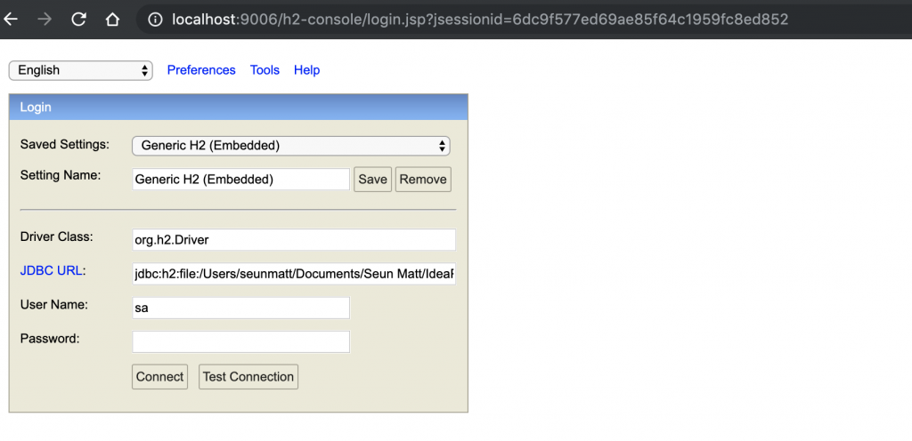

# 带H2数据库的Spring Boot

## 1. 概述
在本教程中，我们将探索将H2与Spring Boot结合使用。就像其他数据库一样，Spring Boot生态系统对其提供了完全的内在支持。

## 2. 依赖关系
因此，让我们从h2和spring-boot-starter-data-jpa依赖关系开始：

```xml
<dependency>
    <groupId>org.springframework.boot</groupId>
    <artifactId>spring-boot-starter-data-jpa</artifactId>
</dependency>
<dependency>
    <groupId>com.h2database</groupId>
    <artifactId>h2</artifactId>
    <scope>runtime</scope>
</dependency>
```

## 3. 数据库配置
默认情况下，Spring Boot将应用程序配置为使用用户名sa和空密码连接到内存中的存储。但是，我们可以通过将以下属性添加到application.properties文件来更改这些参数：

```properties
spring.datasource.url=jdbc:h2:mem:testdb
spring.datasource.driverClassName=org.h2.Driver
spring.datasource.username=sa
spring.datasource.password=password
spring.jpa.database-platform=org.hibernate.dialect.H2Dialect
```

根据设计，内存数据库是易失性的，当我们重新启动应用程序时，数据将丢失。

我们可以通过使用基于文件的存储来更改该行为。为此，我们需要更新spring.datasource.url：

`spring.datasource.url=jdbc:h2:file:/data/demo`
数据库还可以[其他方式运行](http://www.h2database.com/html/features.html#connection_modes)。

## 4.数据库操作
在Spring Boot中使用H2进行CRUD操作与其他SQL数据库相同，并且我们在Spring Persistence系列中的教程对此做了很好的介绍。

同时，让我们在src / main / resources中添加一个data.sql文件：

```sql
CREATE TABLE billionaires (
  id INT AUTO_INCREMENT  PRIMARY KEY,
  first_name VARCHAR(250) NOT NULL,
  last_name VARCHAR(250) NOT NULL,
  career VARCHAR(250) DEFAULT NULL
);

INSERT INTO billionaires (first_name, last_name, career) VALUES
('Aliko', 'Dangote', 'Billionaire Industrialist'),
('Bill', 'Gates', 'Billionaire Tech Entrepreneur'),
('Folrunsho', 'Alakija', 'Billionaire Oil Magnate');
```

在应用程序启动期间，Spring Boot将自动拾取data.sql并针对我们配置的H2数据库运行它。 这是为测试或其他目的植入数据库的好方法。

## 5.访问H2控制台
H2数据库具有嵌入式GUI控制台，用于浏览数据库的内容并运行SQL查询。默认情况下，Spring中未启用H2控制台。因此，要启用它，我们需要在application.properties中添加以下属性：

`spring.h2.console.enabled=true`
然后，在启动应用程序之后，我们可以导航到http：// localhost：8080 / h2-console，它将为我们提供一个登录页面。在登录页面上，我们将提供与application.properties中使用的相同的凭据：



连接后，我们将看到一个综合的网页，该网页在页面左侧列出了所有表，并提供了一个用于运行SQL查询的文本框：


Web控制台具有建议SQL关键字的自动完成功能。控制台是轻量级的，因此便于直观地检查数据库或直接执行原始SQL。

此外，我们可以通过使用所需的值在项目的application.properties中指定以下属性来进一步配置控制台：

```properties
spring.h2.console.path=/h2-console
spring.h2.console.settings.trace=false
spring.h2.console.settings.web-allow-others=false
```

在上面的代码段中，我们将控制台路径设置为/ h2-console，它相对于正在运行的应用程序的地址和端口。因此，如果我们的应用程序在http：// localhost：9001上运行，那么控制台将在http：// localhost：9001 / h2-console上可用。

此外，我们将spring.h2.console.settings.trace设置为false以防止跟踪输出，也可以通过将spring.h2.console.settings.web-allow-others设置为false来禁用远程访问。

## 6.结论
H2数据库与Spring Boot完全兼容。我们已经了解了如何配置它以及如何使用H2控制台来管理正在运行的数据库。

完整的源代码可在Github上获得。